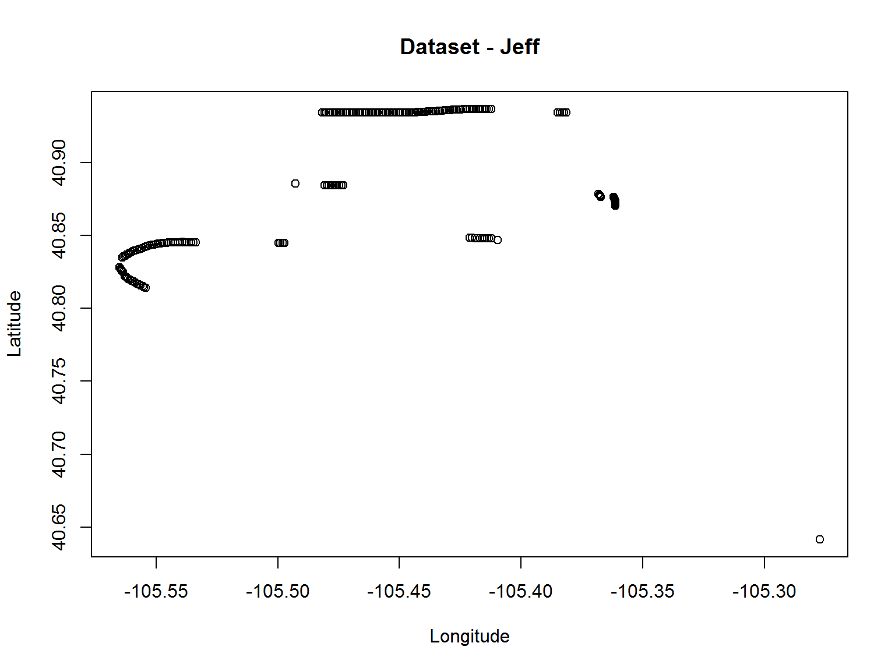
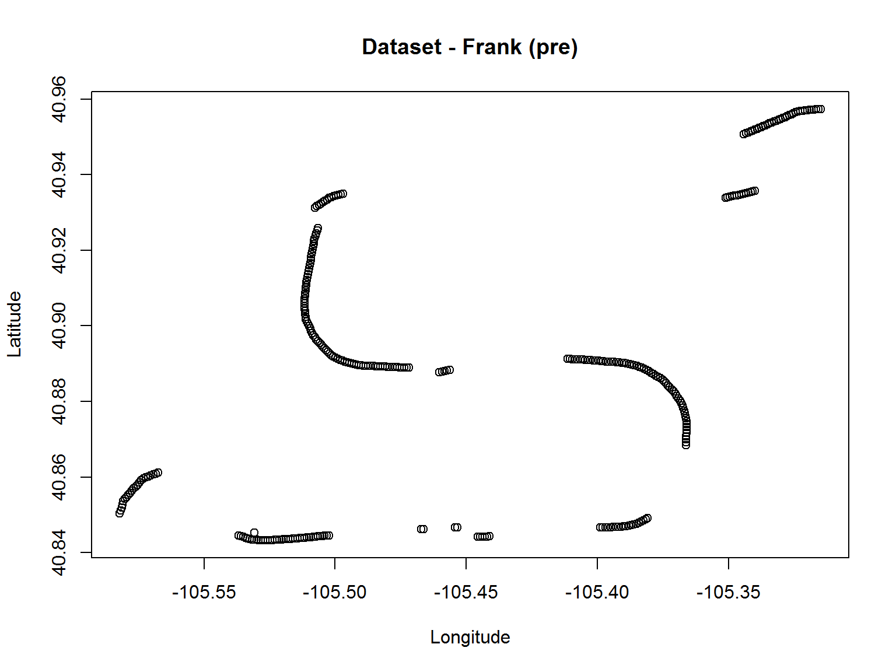
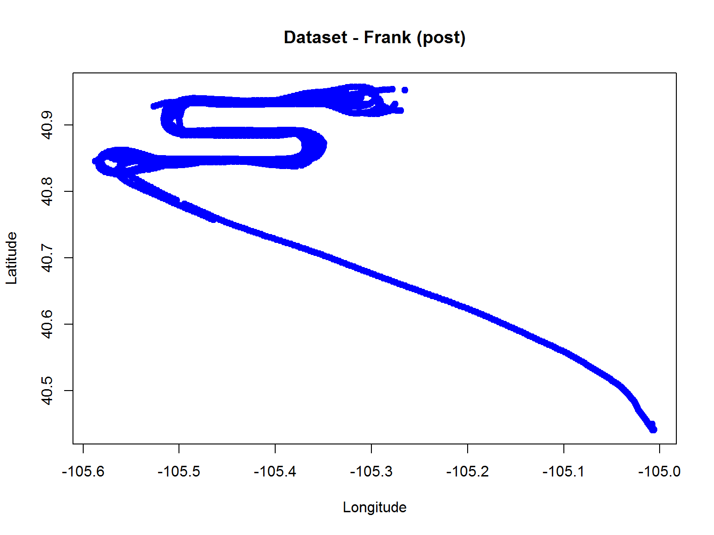
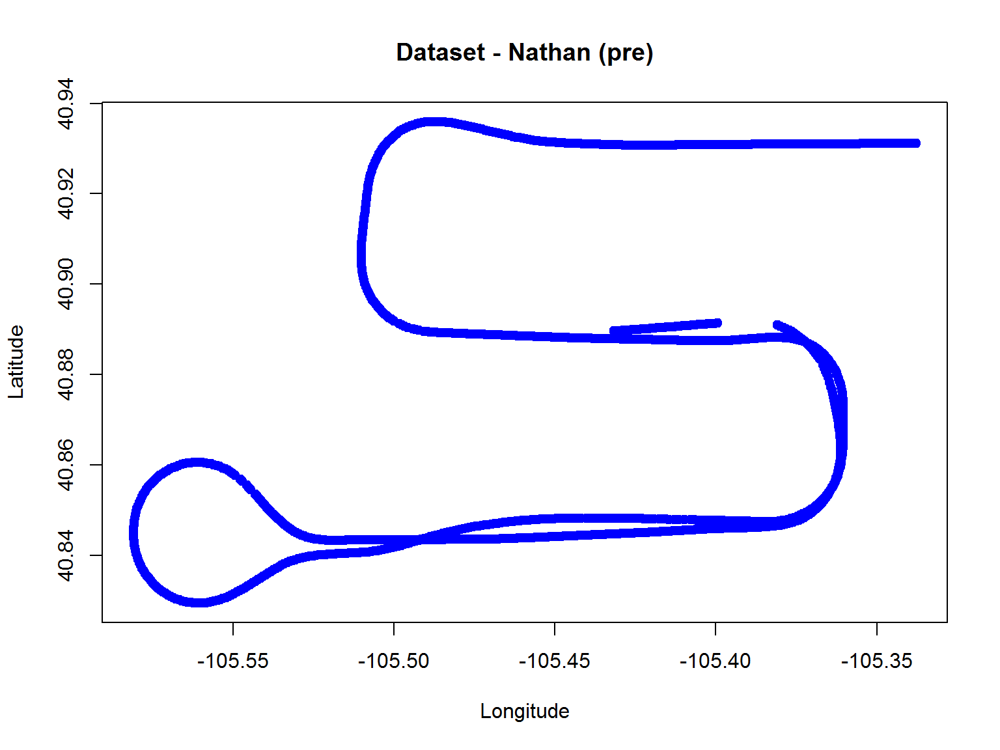
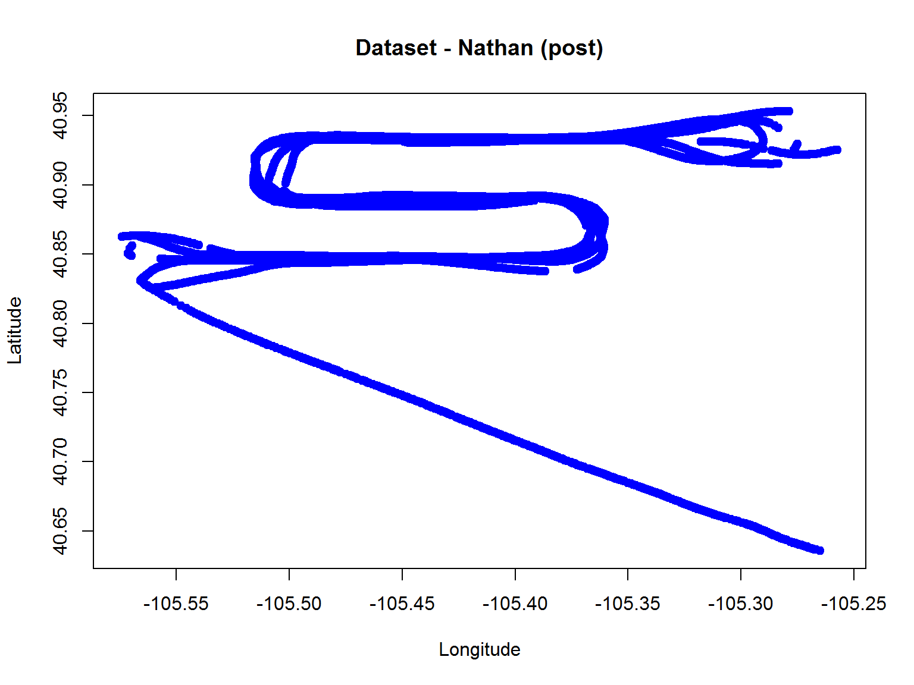

Analysis of GPS Variance in the Context of DMSM
================================

**Principal Author**  
Dr. John R. Withrow Jr.  
Cherokee Nation Technologies  
Contractor for USDA-FS FHTET  
NRRC Building A Ste 331  
2150 Centre Avenue  
Fort Collins, CO 80526  
johnwithrow@fs.fed.us  


### Executive Summary (Version Dated 20160622)
The most representative datasets from each observer have been determined based upon inspection of files from Nathan. They are organized in the following chart:

|           | Jeff           | Frank                           | Nathan                          |
|-----------|:--------------:|:-------------------------------:|:-------------------------------:|
|  Pre-DMSM | GPGGA_drew.csv | GPGGA_jlp.csv                   | Analysis.xlsx, Worksheet 1      |
| Post-DMSM |      -         | offlinedata.gdb/LOCATION_POINTS | offlinedata.gdb/LOCATION_POINTS |

For both Frank and Nathan signficant discrepancies between the Pre-DMSM and Post-DMSM information are visible. More investigation into this is warranted.

Investigation on differences with Nathan's unit due to the location of a nearby bluetooth GPS is on hold.  I am not sure how to discern the observations with the GPS device in the seat near the plane wing from the observations where the GPS device was near the front of the plane.  The shape file called BTWING.shp appears to contain not half the data, but all the data.

The best Pre-DMSM datasets from Jeff and Frank appear fragmented enough as to warrant a check to see if these are indeed the best sources of information.

For both Frank and Nathan, more observations appear in the Post-DMSM datasets than in the Pre-DMSM datasets, implying an interpolation process by the DMSM software described by Conly.

***

### Analytical Context

Some users of the DMSM interface have reported instances where the GPS location on the unit appears to lag behind the actual apparent location of the plane.  Four alternate hypotheses exist as explanations for this:  
1. This occurs when the GPS device is not receiving any location information,  
2. This occurs when the GPS device is receiving unusually erroneous information,   
3. This occurs as a result of a constant positional averaging process onboard the tablet but independent of the DMSM software, and  
4. This occurs as a result of a constant positional averaging process in the DMSM software.

The goal of the present analysis is to investigate the incoming raw GPS information onboard each of three tablets showing simultaneous recordings of the same 10 flight events on 09 Oct 2015.  More specifically, the variability in location and positional accuracy will be investigated in light of the above four hypotheses.

One of the three laptops was connected via bluetooth to an external GPS device of higher quality.  This external GPS device was located in the front of the airplane for five runs and for the other five runs was moved to a seat where the plane's wings would likely obscure signals from many GPS satellites.

The raw data takes the form of a series of multiple text files with data conforming to the National Marine Electronics Association (NMEA) format.  These are read by the DMSM software, which outputs positional information as a feature class in an ESRI geodatabase.  It is thought that in particular hypothesis 4 can be addressed via a direct comparison of positional information from these two sources.

Hypothesis 1 would be consistent with observing many temporal discontinuities in the GPS information.  Hypothesis 2 would be consistent with positional information that is either highly variable or reported as having high positional uncertainty.

Hypothesis 3 would be consistent with observing GPS coordinates that suggest that the plane is unrealistically speeding up and/or slowing down as it progresses through its course.

#### Software Environment - sessionInfo()

```r
sessionInfo()
```

```
## R version 3.3.0 (2016-05-03)
## Platform: x86_64-w64-mingw32/x64 (64-bit)
## Running under: Windows 7 x64 (build 7601) Service Pack 1
## 
## locale:
## [1] LC_COLLATE=English_United States.1252 
## [2] LC_CTYPE=English_United States.1252   
## [3] LC_MONETARY=English_United States.1252
## [4] LC_NUMERIC=C                          
## [5] LC_TIME=English_United States.1252    
## 
## attached base packages:
## [1] stats     graphics  grDevices utils     datasets  methods   base     
## 
## other attached packages:
## [1] knitr_1.13
## 
## loaded via a namespace (and not attached):
##  [1] magrittr_1.5    formatR_1.4     htmltools_0.3.5 tools_3.3.0    
##  [5] Rcpp_0.12.5     stringi_1.1.1   rmarkdown_0.9.6 stringr_1.0.0  
##  [9] digest_0.6.9    evaluate_0.9
```
Random Number Seed: 19680828

```r
set.seed(19680828)
```
Working Directory

```r
setwd("D:\\Projects\\GIS_Projects\\20160617 DMSM GPS")
```

***

### Analytical Process
#### Data Location
All data for this investigation has been placed in the following directory:
\\sxfnlnas001\fhtet\Projects\DMSM\GPS

#### 20160617 Discussion with Sapio, Monahan, Edberg, Conly
Initial briefing of issue and hypothesis.  Discussion of data format and location.  Andy Trent at Missoula is listed as a good contact.  The data is stored according to tablet owner, not tablet user.  The three tablets are:  
1. "Jeff" - used by Nathan - connected by bluetooth to the external GPS  
2. "Drew" - used by Jeff  
3. "Jeanine" - used by Frank

The raw NMEA files show a variety of information sequentially output over time.  Each line begins with a five character delimeter preceeded by a dollar sign, which shows the type of information to follow to the EOL. So far it appears that four our purposes, the necessary data for the present analysis should be found exclusively in lines with the following delimiters:

$GPGGA - showing position and time  
$GPGSV - satellites used in the present position calculation

More specifically, according to aprs.gids.nl/nmea these lines are delimited as follows:

$GPGGA,hhmmss.ss,llll.ll,a,yyyyy.yy,a,x,xx,x.x,x.x,M,x.x,M,x.x,xxxx*hh  
1    = UTC of Position  
2    = Latitude  
3    = N or S  
4    = Longitude  
5    = E or W  
6    = GPS quality indicator (0=invalid; 1=GPS fix; 2=Diff. GPS fix)  
7    = Number of satellites in use [not those in view]  
8    = Horizontal dilution of position  
9    = Antenna altitude above/below mean sea level (geoid)  
10   = Meters  (Antenna height unit)  
11   = Geoidal separation (Diff. between WGS-84 earth ellipsoid and  
       mean sea level.  -=geoid is below WGS-84 ellipsoid)  
12   = Meters  (Units of geoidal separation)  
13   = Age in seconds since last update from diff. reference station  
14   = Diff. reference station ID#  
15   = Checksum  

$GPGSV,1,1,13,02,02,213,,03,-3,000,,11,00,121,,14,13,172,05*67  
1    = Total number of messages of this type in this cycle  
2    = Message number  
3    = Total number of SVs in view  
4    = SV PRN number  
5    = Elevation in degrees, 90 maximum  
6    = Azimuth, degrees from true north, 000 to 359  
7    = SNR, 00-99 dB (null when not tracking)  
8-11 = Information about second SV, same as field 4-7  
12-15= Information about third SV, same as field 4-7  
16-19= Information about fourth SV, same as field 4-7  

Investigations should begin with the information in the GPGGA lines.

#### 20160617 Data Investigation
**Drew's Tablet (Operated by Jeff)**  
A series of what appear to be 11 raw NMEA files are observed, along with:
Ten jpg files showing different passes
Jeanine.mxd (contents unknown as it was made using a later version of ArcGIS)

Useful_nmea_drew - contains only GPGGA, GPGSV, and GPRMC tags, perhaps a subsetted concatenation of all the raw files  
GPGGA_drew.csv - GPGGA lines only

I checked that the first GPGGA line of every raw NMEA file is also visible in GPGGA_drew.csv.  We'll go with primarily this file for analysis.

**Jeanine's Tablet (Operated by Frank)**  
Again, a series of what appear to be 11 raw NMEA files are observed, along with two other files:  
Useful_nmea_jlp - contains only GPGGA, GPGSV, and GPRMC tags, perhaps a subsetted concatenation of all the raw files  
GPGGA_jlp.csv - 315 GPGGA records from time stamp 164549 to 183753  
GPGGA_jlp.xlsx - Same contents as previous file  
GPGGA_jlp2.csv - Same as previous file but only showing LAT/LONG (corrected), Fix_Qual, Num_Sat, HDOP, and ASL  

We need the time stamp, so we'll go with the first file for analysis of incoming GPS data to DMSM.

There is also an offlinedata.gdb ESRI GDB that contains feature class LOCATION_POINTS, which appears to contain the final GPS data post DMSM.  No other point feature classes exist in the GDB that contain significant data.  We'll go with LOCATION_POINTS for the post-DMSM GPS data.

**Jeff's Tablet (Operated by Nathan)**
Raw data files do not exist in the same form as for the other tablets.  Directories exist showing a full dump of tablet contents and a series of screenshots.  Also a series of jpg files are observed similar to those of Drew's tablet.  In addition, we observe the following:  
Useful_nmea_mai.txt - GPGGA, GPGSV,GPRMC tags from time stamp 183859.89 to 184536.00 and then what appears to be a lot of missing data from time stamp 000000.00 to 000553.00.  
GPGGA_mai.csv - GPGGA lines only from time stamp 183900 to 184536 and same missing data from 000000 to 000553.  
Analysis.xlsx - Two worksheets  
- 2015-10-09_113518_BTWING$ - Records from time stamp 17:35:19 - 18:45:36  
- All$ - Records from time stamp 17:17:27 - 17:34:59 (ironically fewer records)  
BTWING.shp - Point shape file containing records from time stamp 17:35:19 - 18:45:36  

The most complete set of records appears to come from either the first worksheet of Analysis.xlsx or BTWING.shp.  We'll go with these for the pre-DMSM GPS data.

There is also an offlinedata.gdb ESRI GDB that contains feature class LOCATION_POINTS, which appears to contain the final GPS data post DMSM.  No other point feature classes exist in the GDB that contain significant data.  We'll go with LOCATION_POINTS for the post-DMSM GPS data.

One remaining concern is that I am not sure how to discern the observations with the GPS device in the seat near the plane wing.  The shape file called BTWING.shp appears to contain not half the data, but all the data.

#### 20160617 Email/Discussion with Conly
Conly has inspected the DMSM code for positional averaging algorithms.  None were found.  Hypothesis 4 appears unlikely.  However, an algorithm is utilized by the software to anticipate changes in direction, using an ongoing regression algorithm on directional angle.  Perhaps if it turns out that hypotheses 1 or 2 are true, then a similar algorithm can be utilized to project the plane's movement more smoothly.

His full email follows:  
Most of the code for dealing with GPS points in DMSM is in a function in a 280 line function that checks the preferences for: minimum distance, logging point spacing, observer position and smoothing window.

1.  If the distance from the last point is less than specified, it doesn't do anything with the point coming from GPS. It won't log the point, calculate rotation, or update the plane location.  
2.  If distance is greater than logging spacing, it will log it. You cannot have a logging distance less than your minimum distance.  
3.  Location smoothing 1) calculate angle from linear regression and then 2) calculate angle from endpoints . There's some  logic to resolve which one to use. I'll omit the code here, but I'm happy to share it with John or whomever - it shouldn't be causing the location lag unless it takes too long to execute.  
4.  Resolves the observer position with rotation - there's more complex logic here.  
5.  Finally it updates the plane location on the screen using location,  observer position and rotation.  

The bottom line here is that it will not update the plane location unless the distance exceeds the threshold established by minimum distance.  We could ask the people complaining about this where their minimum distance is set. The default is 5m - which should be small enough. 

Here are a couple of clarifications - 

Minimum distance is the increment in which everything else occurs. 
Location smoothing is only relevant when calculating the angle of the plane. There is no location averaging otherwise. 

#### Preprocessing Steps

The following files were created from manual procedures in ArcGIS:

***"D:\\Projects\\GIS_Projects\\20160617 DMSM GPS\\Frank_post.txt"***  
Exported the Attribute table from the feature class "\\\\sxfnlnas001\\fhtet\\Projects\\DMSM\\GPS\\1510_GPSTest\\Jeanine_Tab\\offlinedata.gdb\\LOCATION_POINTS

***"D:\\Projects\\GIS_Projects\\20160617 DMSM GPS\\Nathan_post.txt"***  
Exported the Attribute table from the feature class "\\\\sxfnlnas001\\fhtet\\Projects\\DMSM\\GPS\\1510_GPSTest\\Jeff_Tab\\offlinedata.gdb\\LOCATION_POINTS

#### Analysis 20160617

We name the datasets according to operator.

#### Jeff

Reading in the data:

```r
Jeff_preFN <- "X:\\Projects\\DMSM\\GPS\\1510_GPSTest\\Drew_Tab\\GPGGA_drew.csv"
Jeff_pre <- read.csv(Jeff_preFN,header=TRUE,row.names=NULL)
```

We have an initial inspection of the dataset:

```r
str(Jeff_pre)
```

```
## 'data.frame':	196 obs. of  15 variables:
##  $ row.names: chr  "$GPGGA" "$GPGGA" "$GPGGA" "$GPGGA" ...
##  $ Sentence : num  163931 163932 163933 163934 163935 ...
##  $ Time_Z   : num  4053 4053 4053 4053 4053 ...
##  $ Lat      : Factor w/ 2 levels "","N": 2 2 2 2 2 2 2 2 2 2 ...
##  $ N_S      : num  10528 10528 10528 10529 10529 ...
##  $ Long     : Factor w/ 2 levels "","W": 2 2 2 2 2 2 2 2 2 2 ...
##  $ E_W      : int  1 1 1 1 1 1 1 1 1 1 ...
##  $ Fix_Qual : int  13 13 14 13 15 14 14 14 14 14 ...
##  $ Num_Sat  : num  3.2 3.2 2.4 2.4 2.4 2.4 2.4 1.6 1.6 1.6 ...
##  $ HDOP     : num  2906 2909 2911 2912 2911 ...
##  $ ASL      : Factor w/ 1 level "M": 1 1 1 1 1 1 1 1 1 1 ...
##  $ H_geoid  : num  -20.5 -20.5 -20.5 -20.5 -20.5 -20.5 -20.5 -20.5 -20.5 -20.5 ...
##  $ Time_last: Factor w/ 1 level "M": 1 1 1 1 1 1 1 1 1 1 ...
##  $ DGPS_id  : logi  NA NA NA NA NA NA ...
##  $ Checksum : Factor w/ 22 levels "*50","*51","*52",..: 22 17 22 21 14 16 7 19 8 7 ...
```

```r
head(Jeff_pre)
```

```
##   row.names Sentence   Time_Z Lat      N_S Long E_W Fix_Qual Num_Sat
## 1    $GPGGA   163931 4053.044   N 10528.38    W   1       13     3.2
## 2    $GPGGA   163932 4053.044   N 10528.43    W   1       13     3.2
## 3    $GPGGA   163933 4053.044   N 10528.49    W   1       14     2.4
## 4    $GPGGA   163934 4053.045   N 10528.54    W   1       13     2.4
## 5    $GPGGA   163935 4053.046   N 10528.59    W   1       15     2.4
## 6    $GPGGA   163936 4053.047   N 10528.64    W   1       14     2.4
##     HDOP ASL H_geoid Time_last DGPS_id Checksum
## 1 2905.6   M   -20.5         M      NA      *6F
## 2 2909.1   M   -20.5         M      NA      *6A
## 3 2911.3   M   -20.5         M      NA      *6F
## 4 2911.5   M   -20.5         M      NA      *6E
## 5 2911.2   M   -20.5         M      NA      *67
## 6 2910.5   M   -20.5         M      NA      *69
```

We only need the fields "TimeZ","Lat","Long","NumSat","HDOP" and need to change the Lat and Long fields to decimal degrees.  We also remove lines containing missing data:

```r
Jeff_pre <- Jeff_pre[,c(2,3,5,8,9,10)]
colnames(Jeff_pre) <- c("TimeZ","Lat","Long","FixQual","NumSat","HDOP")
Jeff_pre$Lat <- floor(Jeff_pre$Lat/100) + (Jeff_pre$Lat %% 100)/60
Jeff_pre$Long <- -1*(floor(Jeff_pre$Long/100) + (Jeff_pre$Long %% 100)/60)
Jeff_pre <- Jeff_pre[complete.cases(Jeff_pre),]
```

Plotting this dataset in latitude/longitude coordinates:

```r
plot(Jeff_pre$Long,Jeff_pre$Lat,xlab="Longitude",ylab="Latitude",main="Dataset - Jeff")
```



***

#### Frank

Reading in the Pre-DMSM data:

```r
Frank_preFN <- "X:\\Projects\\DMSM\\GPS\\1510_GPSTest\\Jeanine_Tab\\GPGGA_jlp.csv"
Frank_pre <- read.csv(Frank_preFN,header=TRUE)
```

We have an initial inspection of the dataset:

```r
str(Frank_pre)
```

```
## 'data.frame':	314 obs. of  15 variables:
##  $ Sentence: Factor w/ 1 level "$GPGGA": 1 1 1 1 1 1 1 1 1 1 ...
##  $ Time_Z  : num  164549 164550 164551 164552 164553 ...
##  $ Lat     : num  4057 4057 4057 4057 4057 ...
##  $ N_S     : Factor w/ 1 level "N": 1 1 1 1 1 1 1 1 1 1 ...
##  $ Long    : num  10519 10519 10519 10519 10519 ...
##  $ E_W     : Factor w/ 1 level "W": 1 1 1 1 1 1 1 1 1 1 ...
##  $ Fix_Qual: int  1 1 1 1 1 1 1 1 1 1 ...
##  $ Num_Sat : int  14 13 12 13 14 14 14 14 14 12 ...
##  $ HDOP    : num  2.4 1.6 3.2 2.4 2.4 2.4 3.2 2.4 4.8 4.8 ...
##  $ ASL     : num  2900 2900 2901 2901 2902 ...
##  $ X       : Factor w/ 1 level "M": 1 1 1 1 1 1 1 1 1 1 ...
##  $ H_geoid : num  -20.4 -20.4 -20.4 -20.4 -20.4 -20.4 -20.4 -20.4 -20.4 -20.4 ...
##  $ X.1     : Factor w/ 1 level "M": 1 1 1 1 1 1 1 1 1 1 ...
##  $ X.2     : logi  NA NA NA NA NA NA ...
##  $ Checksum: Factor w/ 16 levels "*60","*61","*62",..: 10 16 7 8 16 1 4 15 16 4 ...
```

```r
head(Frank_pre)
```

```
##   Sentence Time_Z      Lat N_S     Long E_W Fix_Qual Num_Sat HDOP    ASL X
## 1   $GPGGA 164549 4057.443   N 10518.89   W        1      14  2.4 2900.2 M
## 2   $GPGGA 164550 4057.441   N 10518.94   W        1      13  1.6 2900.5 M
## 3   $GPGGA 164551 4057.435   N 10518.99   W        1      12  3.2 2900.7 M
## 4   $GPGGA 164552 4057.432   N 10519.05   W        1      13  2.4 2901.2 M
## 5   $GPGGA 164553 4057.427   N 10519.10   W        1      14  2.4 2902.5 M
## 6   $GPGGA 164554 4057.427   N 10519.15   W        1      14  2.4 2902.5 M
##   H_geoid X.1 X.2 Checksum
## 1   -20.4   M  NA      *69
## 2   -20.4   M  NA      *6F
## 3   -20.4   M  NA      *66
## 4   -20.4   M  NA      *67
## 5   -20.4   M  NA      *6F
## 6   -20.4   M  NA      *60
```

We only need the "TimeZ","Lat","Long","NumSat","HDOP" fields, and need to change Lat and Long to decimal degrees:

```r
Frank_pre <- Frank_pre[,c(2,3,5,7,8,9,10)]
colnames(Frank_pre) <- c("TimeZ","Lat","Long","FixQual","NumSat","HDOP","ASL")
Frank_pre$Lat <- floor(Frank_pre$Lat/100) + (Frank_pre$Lat %% 100)/60
Frank_pre$Long <- -1*(floor(Frank_pre$Long/100) + (Frank_pre$Long %% 100)/60)
```

Plotting this dataset in latitude/longitue coordinates:

```r
plot(Frank_pre$Long,Frank_pre$Lat,xlab="Longitude",ylab="Latitude",main="Dataset - Frank (pre)")
```



Reading in the Post-DMSM data:

```r
Frank_postFN <- "D:\\Projects\\GIS_Projects\\20160617 DMSM GPS\\Frank_post.txt"
Frank_post <- read.csv(Frank_postFN,header=TRUE)
```

We have an initial inspection of the dataset:

```r
str(Frank_post)
```

```
## 'data.frame':	1930 obs. of  12 variables:
##  $ FID       : Factor w/ 1930 levels "0","1","1,000",..: 1 2 1043 1154 1265 1376 1487 1598 1709 1820 ...
##  $ DATE      : Factor w/ 1 level "10/9/2015 0:00:00": 1 1 1 1 1 1 1 1 1 1 ...
##  $ ELEVATION : int  0 0 0 0 0 0 0 0 0 0 ...
##  $ STATUS    : int  0 0 0 0 0 0 0 0 0 0 ...
##  $ REGION_ID : int  2 2 2 2 2 2 2 2 2 2 ...
##  $ LOCATION_P: Factor w/ 1930 levels "{000f650a-64eb-4b25-b0da-5e6b6fb11d8d}",..: 1553 1064 961 1395 1678 1599 117 1140 1137 1420 ...
##  $ MISSION_ID: logi  NA NA NA NA NA NA ...
##  $ GlobalID  : Factor w/ 1930 levels "{004C57F7-52A5-4224-8DE2-4023FEF143FB}",..: 1647 1830 1312 1155 1034 658 604 1166 1765 1054 ...
##  $ OBJECTID  : Factor w/ 1930 levels "1","1,002","1,003",..: 1 888 1360 1443 1535 1617 1693 1764 1862 785 ...
##  $ Pass      : int  0 0 0 0 0 0 0 0 0 0 ...
##  $ POINT_X   : num  -105 -105 -105 -105 -105 ...
##  $ POINT_Y   : num  40.4 40.4 40.4 40.4 40.4 ...
```

```r
head(Frank_post)
```

```
##   FID              DATE ELEVATION STATUS REGION_ID
## 1   0 10/9/2015 0:00:00         0      0         2
## 2   1 10/9/2015 0:00:00         0      0         2
## 3   2 10/9/2015 0:00:00         0      0         2
## 4   3 10/9/2015 0:00:00         0      0         2
## 5   4 10/9/2015 0:00:00         0      0         2
## 6   5 10/9/2015 0:00:00         0      0         2
##                               LOCATION_P MISSION_ID
## 1 {cf03aadb-f3e2-4239-8c08-69afb06a16eb}         NA
## 2 {8dedf83a-12b7-4ced-8345-617ba86b0955}         NA
## 3 {810a1d37-a613-4975-a217-36abe4b09d2e}         NA
## 4 {b6a70192-7f37-4b49-810b-cc9e297b1cfa}         NA
## 5 {e01380aa-db2b-48e4-9450-6cf1e1829089}         NA
## 6 {d6293fce-faf8-4018-9dc4-676b3a1a9674}         NA
##                                 GlobalID OBJECTID Pass   POINT_X  POINT_Y
## 1 {DCB56D16-F861-4EDE-9040-E016682F3DBE}        1    0 -105.0080 40.44935
## 2 {F2D7EB16-73EE-43C5-96C3-BBA69456F668}        2    0 -105.0086 40.44662
## 3 {B07035FB-AE19-4560-A547-13B977FF8284}        3    0 -105.0082 40.44965
## 4 {9B2686DC-0DAC-41AF-8F01-83668E17295F}        4    0 -105.0082 40.44604
## 5 {89DE5BED-70DE-4366-B012-1E69CCAFF260}        5    0 -105.0073 40.44389
## 6 {5456114A-2D5C-4F30-85F6-213F138908DD}        6    0 -105.0061 40.44130
```

Lat and Long fields appear to be already converted, and only the Lat and Long fields are useable:

```r
Frank_post <- Frank_post[,11:12]
colnames(Frank_post) <- c("Long","Lat")
```

Plotting this dataset in the latitude/longitude plane:

```r
plot(Frank_post$Long,Frank_post$Lat,pch=19,col="blue",xlab="Longitude",ylab="Latitude",main="Dataset - Frank (post)")
```



Frank's Post-DMSM dataset contains 1930 observations, significantly more than the 314 observations in his Pre-DMSM dataset.  Interpolation by the the DMSM software is imiplicated.

***

#### Nathan

Reading in the Pre-DMSM data:

```r
library(xlsx)
```

```
## Loading required package: rJava
```

```
## Loading required package: xlsxjars
```

```r
Nathan_preFN <- "X:\\Projects\\DMSM\\GPS\\1510_GPSTest\\Jeff_Tab\\Analysis.xlsx"
Nathan_pre <- read.xlsx(Nathan_preFN,1,header=TRUE)
```

We have an initial inspection of the dataset:

```r
str(Nathan_pre)
```

```
## 'data.frame':	1024 obs. of  20 variables:
##  $ Lat        : num  40.9 40.9 40.9 40.9 40.9 ...
##  $ Lng        : num  -105 -105 -105 -105 -105 ...
##  $ Alt        : num  2889 2889 2889 2888 2888 ...
##  $ Acc        : num  2.05 2.05 2.28 2.31 2.31 2.32 2.32 2.32 2.32 2.07 ...
##  $ Time       : Factor w/ 1022 levels "2015-10-09T17:17:27.000Z",..: 1 2 3 4 5 6 7 8 9 10 ...
##  $ Prv        : Factor w/ 1022 levels "17:17:27.000Z",..: 1 2 3 4 5 6 7 8 9 10 ...
##  $ OrgLat     : num  40.9 40.9 40.9 40.9 40.9 ...
##  $ OrgLng     : num  -105 -105 -105 -105 -105 ...
##  $ OrgAlt     : num  2889 2889 2889 2888 2888 ...
##  $ OrgAcc     : num  2.45 2.47 2.92 2.92 2.92 2.92 2.92 2.92 2.92 2.47 ...
##  $ Speed      : num  82.1 82.2 82.3 82.3 82.4 ...
##  $ Bearing    : num  86.4 86.4 86.3 86.3 86.3 ...
##  $ AdvPrv     : Factor w/ 1 level "gps [GPS]": 1 1 1 1 1 1 1 1 1 1 ...
##  $ Dly        : POSIXct, format: "1899-12-30 00:00:00" "1899-12-30 00:00:01" ...
##  $ Dst        : num  0 82.3 72.9 80.8 82.1 82.3 82.4 82.3 82.4 92.1 ...
##  $ AltOfst    : num  0 0 0 0 0 0 0 0 0 0 ...
##  $ Pressure   : logi  NA NA NA NA NA NA ...
##  $ PressureRef: logi  NA NA NA NA NA NA ...
##  $ RefAge     : logi  NA NA NA NA NA NA ...
##  $ FromBT     : logi  FALSE FALSE FALSE FALSE FALSE FALSE ...
```

```r
head(Nathan_pre)
```

```
##        Lat       Lng    Alt  Acc                     Time           Prv
## 1 40.88961 -105.4316 2889.0 2.05 2015-10-09T17:17:27.000Z 17:17:27.000Z
## 2 40.88966 -105.4307 2888.9 2.05 2015-10-09T17:17:28.000Z 17:17:28.000Z
## 3 40.88970 -105.4298 2888.7 2.28 2015-10-09T17:17:29.000Z 17:17:29.000Z
## 4 40.88975 -105.4288 2888.5 2.31 2015-10-09T17:17:30.000Z 17:17:30.000Z
## 5 40.88980 -105.4279 2888.3 2.31 2015-10-09T17:17:31.000Z 17:17:31.000Z
## 6 40.88985 -105.4269 2888.2 2.32 2015-10-09T17:17:32.000Z 17:17:32.000Z
##     OrgLat    OrgLng OrgAlt OrgAcc Speed Bearing    AdvPrv
## 1 40.88963 -105.4312 2889.0   2.45 82.08   86.43 gps [GPS]
## 2 40.88968 -105.4302 2888.9   2.47 82.18   86.36 gps [GPS]
## 3 40.88973 -105.4292 2888.7   2.92 82.28   86.33 gps [GPS]
## 4 40.88978 -105.4283 2888.5   2.92 82.31   86.30 gps [GPS]
## 5 40.88983 -105.4273 2888.3   2.92 82.39   86.26 gps [GPS]
## 6 40.88988 -105.4263 2888.2   2.92 82.41   86.25 gps [GPS]
##                   Dly  Dst AltOfst Pressure PressureRef RefAge FromBT
## 1 1899-12-30 00:00:00  0.0       0       NA          NA     NA  FALSE
## 2 1899-12-30 00:00:01 82.3       0       NA          NA     NA  FALSE
## 3 1899-12-30 00:00:01 72.9       0       NA          NA     NA  FALSE
## 4 1899-12-30 00:00:01 80.8       0       NA          NA     NA  FALSE
## 5 1899-12-30 00:00:01 82.1       0       NA          NA     NA  FALSE
## 6 1899-12-30 00:00:01 82.3       0       NA          NA     NA  FALSE
```

Lat and Long fields appear to be already converted.  We only need the "Lat","Long","Alt","Acc","Time","OrgAcc","Speed","Bearing" fields:

```r
Nathan_pre <- Nathan_pre[,c(1,2,3,4,6,10,11,12)]
colnames(Nathan_pre) <- c("Lat","Long","Alt","Acc","Time_Z","OrgAcc","Speed","Bearing")
```

Plotting this dataset in the latitude/longitude plane:

```r
plot(Nathan_pre$Long,Nathan_pre$Lat,pch=19,col="blue",xlab="Longitude",ylab="Latitude",main="Dataset - Nathan (pre)")
```



Reading in the Post-DMSM data:

```r
Nathan_postFN <- "D:\\Projects\\GIS_Projects\\20160617 DMSM GPS\\Nathan_post.txt"
Nathan_post <- read.csv(Nathan_postFN,header=TRUE)
```

We have an initial inspection of the dataset:

```r
str(Nathan_post)
```

```
## 'data.frame':	1809 obs. of  13 variables:
##  $ FID       : Factor w/ 1809 levels "0","1","1,000",..: 1 2 922 1033 1144 1255 1366 1477 1588 1699 ...
##  $ DATE      : Factor w/ 1 level "10/9/2015 0:00:00": 1 1 1 1 1 1 1 1 1 1 ...
##  $ ELEVATION : int  0 0 0 0 0 0 0 0 0 0 ...
##  $ STATUS    : int  0 0 0 0 0 0 0 0 0 0 ...
##  $ REGION_ID : int  2 2 2 2 2 2 2 2 2 2 ...
##  $ LOCATION_P: Factor w/ 1809 levels "{0027c88c-d1c9-4181-9dd4-ca595c404fc2}",..: 911 1791 164 1385 1347 659 903 684 1391 753 ...
##  $ MISSION_ID: logi  NA NA NA NA NA NA ...
##  $ GlobalID  : Factor w/ 1809 levels "{009D737B-1C05-42F9-A7E2-AE8239B1AB1F}",..: 937 1350 330 1586 1039 983 258 666 905 803 ...
##  $ OBJECTID  : Factor w/ 1809 levels "1","1,340","1,341",..: 1 574 1267 1378 1489 1600 1711 1788 1799 464 ...
##  $ Pass      : int  0 0 0 0 0 0 0 0 0 0 ...
##  $ HDOP      : num  0 0 0 0 0 0 0 0 0 0 ...
##  $ POINT_X   : num  -105 -105 -105 -105 -105 ...
##  $ POINT_Y   : num  40.6 40.6 40.6 40.6 40.6 ...
```

```r
head(Nathan_post)
```

```
##   FID              DATE ELEVATION STATUS REGION_ID
## 1   0 10/9/2015 0:00:00         0      0         2
## 2   1 10/9/2015 0:00:00         0      0         2
## 3   2 10/9/2015 0:00:00         0      0         2
## 4   3 10/9/2015 0:00:00         0      0         2
## 5   4 10/9/2015 0:00:00         0      0         2
## 6   5 10/9/2015 0:00:00         0      0         2
##                               LOCATION_P MISSION_ID
## 1 {81e7bd2e-dfb1-4bb4-ac5f-aeea0720c2bb}         NA
## 2 {fc7f0465-861e-4964-9c81-0c8c314a6fa8}         NA
## 3 {1882fb2b-42bf-432f-95e1-dea47a88a050}         NA
## 4 {c4a1ca67-2b38-4ac0-a55d-6697d57bfad5}         NA
## 5 {c01c9e23-9dc7-42e1-a84f-1e393e9c7254}         NA
## 6 {5add74ca-0bc1-4a13-a120-fccf3e2cf583}         NA
##                                 GlobalID OBJECTID Pass HDOP   POINT_X
## 1 {807728AA-6100-4A5E-BC7B-D3942BF68B24}        1    0    0 -105.1532
## 2 {B76C4CF5-939C-44A9-B951-243D78702496}        2    0    0 -105.1560
## 3 {2B756310-F87F-449E-B867-2766CC31A1A3}        3    0    0 -105.1589
## 4 {DAC24760-0B1E-4F77-953A-58C4EAFA8EE9}        4    0    0 -105.1618
## 5 {8DD26C98-EE61-419C-BBBB-4994BD28C85F}        5    0    0 -105.1647
## 6 {86344A1A-F93D-4923-B5CD-D09C9C47A0F4}        6    0    0 -105.1675
##    POINT_Y
## 1 40.59375
## 2 40.59564
## 3 40.59754
## 4 40.59944
## 5 40.60133
## 6 40.60322
```

Lat and Long fields appear to be already converted, and only the Lat and Long fields are useable:

```r
Nathan_post <- Nathan_post[,12:13]
colnames(Nathan_post) <- c("Long","Lat")
```

Plotting this dataset in the latitude/longitude plane:

```r
plot(Nathan_post$Long,Nathan_post$Lat,pch=19,col="blue",xlab="Longitude",ylab="Latitude",main="Dataset - Nathan (post)")
```



Nathan's Post-DMSM dataset shows 1809 observations, again more than the 1024 observations in the Pre-DMSM dataset, again implying interpolation by DMSM.

#### 20160623 Discussion with Sapio, Monahan, Edberg, Conly

For Jeff's tablet operated by Nathan, I had previously overlooked the Time and "Little Time" fields in the Analysis.xlsx$2015-10-09_113518_BTWING spreadsheet.  These can be used for comparison with data from the other sources.

#### 20160628 Analysis

For each of the three datasets we convert time to an integer giving the number of seconds since midnight.  These values are added as a new field in the leftmost column.


```r
time <- rep(0,length(Jeff_pre$TimeZ))
for (i in 1:length(Jeff_pre$TimeZ))
{
  temp <- as.numeric(Jeff_pre$TimeZ[i])
  time[i] <- floor(temp/10000)*3600 + floor((temp %% 10000)/100)*60 + (temp %% 100)
}
min(time)
```

```
## [1] 59971
```

```r
max(time)
```

```
## [1] 67513
```

```r
Jeff_pre <- cbind(time,Jeff_pre)
head(Jeff_pre)
```

```
##    time  TimeZ      Lat      Long FixQual NumSat   HDOP
## 1 59971 163931 40.88406 -105.4730      13    3.2 2905.6
## 2 59972 163932 40.88406 -105.4739      13    3.2 2909.1
## 3 59973 163933 40.88407 -105.4748      14    2.4 2911.3
## 4 59974 163934 40.88408 -105.4756      13    2.4 2911.5
## 5 59975 163935 40.88410 -105.4765      15    2.4 2911.2
## 6 59976 163936 40.88412 -105.4773      14    2.4 2910.5
```

```r
time <- rep(0,length(Frank_pre$TimeZ))

for (i in 1:length(Frank_pre$TimeZ))
{
  temp <- as.numeric(Frank_pre$TimeZ[i])
  time[i] <- floor(temp/10000)*3600 + floor((temp %% 10000)/100)*60 + (temp %% 100)
}
min(time)
```

```
## [1] 60349
```

```r
max(time)
```

```
## [1] 67073
```

```r
Frank_pre <- cbind(time,Frank_pre)
head(Frank_pre)
```

```
##    time  TimeZ      Lat      Long FixQual NumSat HDOP    ASL
## 1 60349 164549 40.95738 -105.3148       1     14  2.4 2900.2
## 2 60350 164550 40.95735 -105.3157       1     13  1.6 2900.5
## 3 60351 164551 40.95726 -105.3166       1     12  3.2 2900.7
## 4 60352 164552 40.95719 -105.3174       1     13  2.4 2901.2
## 5 60353 164553 40.95711 -105.3183       1     14  2.4 2902.5
## 6 60354 164554 40.95712 -105.3191       1     14  2.4 2902.5
```

```r
Nathan_pre$Time_Z <- as.character(Nathan_pre$Time_Z)
time <- rep(0,length(Nathan_pre$Time_Z))
for (i in 1:length(Nathan_pre$Time_Z))
{
  time[i] <- as.numeric(substr(Nathan_pre$Time_Z[i],start=1,stop=2))*3600
  time[i] <- time[i] + as.numeric(substr(Nathan_pre$Time_Z[i],start=4,stop=5))*60
  time[i] <- time[i] + as.numeric(substr(Nathan_pre$Time_Z[i],start=7,stop=8))
}
min(time)
```

```
## [1] 62247
```

```r
max(time)
```

```
## [1] 63299
```

```r
Nathan_pre <- cbind(time,Nathan_pre)
head(Nathan_pre)
```

```
##    time      Lat      Long    Alt  Acc        Time_Z OrgAcc Speed Bearing
## 1 62247 40.88961 -105.4316 2889.0 2.05 17:17:27.000Z   2.45 82.08   86.43
## 2 62248 40.88966 -105.4307 2888.9 2.05 17:17:28.000Z   2.47 82.18   86.36
## 3 62249 40.88970 -105.4298 2888.7 2.28 17:17:29.000Z   2.92 82.28   86.33
## 4 62250 40.88975 -105.4288 2888.5 2.31 17:17:30.000Z   2.92 82.31   86.30
## 5 62251 40.88980 -105.4279 2888.3 2.31 17:17:31.000Z   2.92 82.39   86.26
## 6 62252 40.88985 -105.4269 2888.2 2.32 17:17:32.000Z   2.92 82.41   86.25
```

From this it is clear that the minimum and maximum times of all datasets are, respectively, 59971 and 67513 seconds from midnight.  We now build a combined matrix of all datasets using a for loop that travels through all seconds from start to finish and queries all three datasets for information.


```r
tmin <- 59971
tmax <- 67513
buildTable <- matrix(nrow=0,ncol=24)
for (i in seq(tmin,tmax))
{
  jeffss <- Jeff_pre[Jeff_pre$time==i,]
  frankss <- Frank_pre[Frank_pre$time==i,]
  nathanss <- Nathan_pre[Nathan_pre[,1]==i,]
  if (dim(jeffss)[1] > 0)
  {
    part1 <- jeffss
  } else {
    part1 <- rep(NA,7)
  }
  if (dim(frankss)[1] > 0)
  {
    part2 <- frankss
  } else {
    part2 <- rep(NA,8)
  }
  if (dim(nathanss)[1] > 0)
  {
    part3 <- nathanss[1,]
  } else {
    part3 <- rep(NA,9)
  }
  buildTable <- rbind(buildTable,c(as.vector(part1),as.vector(part2),as.vector(part3)))
}
buildTable <- cbind(seq(tmin,tmax),buildTable)
colnames(buildTable) <- c("SetTime","SetTime_Jeff","RecTime_Jeff","Lat_Jeff","Long_Jeff","FixQual_Jeff","NumSat_Jeff","HDOP_Jeff","SetTime_Frank","RecTime_Frank","Lat_Frank","Long_Frank","FixQual_Frank","NumSat_Frank","HDOP_Frank","ASL_Frank","SetTime_Nathan","Lat_Nathan","Long_Nathan","Alt_Nathan","Acc_Nathan","RecTime_Nathan","OrgAcc_Nathan","Speed_Nathan","Bearing_Nathan")
```

Confirming all times are synchronized

```r
temp <- buildTable[!is.na(buildTable[,2]),1:2]
all(as.integer(unlist(temp[,1])) == as.integer(unlist(temp[,2])))
```

```
## [1] TRUE
```

```r
temp <- buildTable[!is.na(buildTable[,9]),c(1,9)]
all(as.integer(unlist(temp[,1])) == as.integer(unlist(temp[,2])))
```

```
## [1] TRUE
```

```r
temp <- buildTable[!is.na(buildTable[,17]),c(1,17)]
all(as.integer(unlist(temp[,1])) == as.integer(unlist(temp[,2])))
```

```
## [1] TRUE
```

```r
rm(temp)
```

Latitudes

```r
latmin <- min(unlist(buildTable[,c(4,11,18)]),na.rm=TRUE)
latmax <- max(unlist(buildTable[,c(4,11,18)]),na.rm=TRUE)
plot(buildTable[,"SetTime"],buildTable[,"Lat_Jeff"],pch=19,xlim=c(tmin,tmax),ylim=c(latmin,latmax),xlab="Time",ylab="Latitude")
points(buildTable[,"SetTime"],buildTable[,"Lat_Frank"],pch=19,col="red")
points(buildTable[,"SetTime"],buildTable[,"Lat_Nathan"],pch=19,col="blue")
```


```r
VarTable <- rep(NA,length(buildTable[,2]))
buildTable <- cbind(buildTable,VarTable,VarTable,VarTable)
colnames(buildTable)[26:28] <- c("LatVar1","LatVar2","LatVar3")
x2_3 <- !is.na(buildTable[,"Lat_Jeff"]) & !is.na(buildTable[,"Lat_Frank"])
all(!x2_3)
```

```
## [1] FALSE
```

```r
buildTable[x2_3,"LatVar1"] = as.numeric(as.matrix(buildTable[,"Lat_Jeff"][x2_3])) - as.numeric(as.matrix(buildTable[,"Lat_Frank"][x2_3]))
x2_4 <- !is.na(buildTable[,"Lat_Jeff"]) & !is.na(buildTable[,"Lat_Nathan"])
all(!x2_4)
```

```
## [1] FALSE
```

```r
buildTable[x2_4,"LatVar2"] = as.numeric(as.matrix(buildTable[,"Lat_Jeff"][x2_4])) - as.numeric(as.matrix(buildTable[,"Lat_Nathan"][x2_4]))
x3_4 <- !is.na(buildTable[,"Lat_Frank"]) & !is.na(buildTable[,"Lat_Nathan"])
all(!x3_4)
```

```
## [1] FALSE
```

```r
buildTable[x3_4,"LatVar3"] = as.numeric(as.matrix(buildTable[,"Lat_Frank"][x3_4])) - as.numeric(as.matrix(buildTable[,"Lat_Nathan"][x3_4]))
varmin <- min(unlist(buildTable[,26:28]),na.rm=TRUE)
varmax <- max(unlist(buildTable[,26:28]),na.rm=TRUE)
buildTable[x2_3,]
```

```
##      SetTime SetTime_Jeff RecTime_Jeff Lat_Jeff Long_Jeff FixQual_Jeff
## [1,] 66858   66858        183418       40.87833 -105.3682 10          
## [2,] 66859   66859        183419       40.87765 -105.3679 6           
## [3,] 66860   66860        183420       40.87695 -105.3675 6           
## [4,] 66861   66861        183421       40.87627 -105.3672 6           
##      NumSat_Jeff HDOP_Jeff SetTime_Frank RecTime_Frank Lat_Frank
## [1,] 3.2         2889.6    66858         183418        40.87894 
## [2,] 3.2         2890.2    66859         183419        40.8783  
## [3,] 3.2         2891.4    66860         183420        40.87762 
## [4,] 3.2         2893.5    66861         183421        40.87695 
##      Long_Frank FixQual_Frank NumSat_Frank HDOP_Frank ASL_Frank
## [1,] -105.3676  1             9            4.8        2896.1   
## [2,] -105.3672  1             6            3.2        2896.6   
## [3,] -105.367   1             7            3.2        2897.9   
## [4,] -105.3666  1             5            4.8        2898     
##      SetTime_Nathan Lat_Nathan Long_Nathan Alt_Nathan Acc_Nathan
## [1,] NA             NA         NA          NA         NA        
## [2,] NA             NA         NA          NA         NA        
## [3,] NA             NA         NA          NA         NA        
## [4,] NA             NA         NA          NA         NA        
##      RecTime_Nathan OrgAcc_Nathan Speed_Nathan Bearing_Nathan
## [1,] NA             NA            NA           NA            
## [2,] NA             NA            NA           NA            
## [3,] NA             NA            NA           NA            
## [4,] NA             NA            NA           NA            
##      LatVar1       LatVar2 LatVar3
## [1,] -0.0006142667 NA      NA     
## [2,] -0.0006542167 NA      NA     
## [3,] -0.0006703    NA      NA     
## [4,] -0.0006744    NA      NA
```

```r
buildTable[x2_4,]
```

```
##      SetTime SetTime_Jeff RecTime_Jeff Lat_Jeff Long_Jeff FixQual_Jeff
## [1,] 62807   62807        172647       40.84817 -105.4211 11          
## [2,] 62808   62808        172648       40.84817 -105.4202 10          
## [3,] 62809   62809        172649       40.84804 -105.4191 11          
## [4,] 62811   62811        172651       40.84782 -105.417  10          
## [5,] 62812   62812        172652       40.84786 -105.4159 10          
## [6,] 62813   62813        172653       40.84791 -105.4149 12          
## [7,] 62814   62814        172654       40.84791 -105.414  12          
## [8,] 62816   62816        172656       40.84783 -105.4122 12          
##      NumSat_Jeff HDOP_Jeff SetTime_Frank RecTime_Frank Lat_Frank
## [1,] 3.2         2887.7    NA            NA            NA       
## [2,] 2.4         2886.4    NA            NA            NA       
## [3,] 2.4         2894.4    NA            NA            NA       
## [4,] 2.4         2908.8    NA            NA            NA       
## [5,] 2.4         2909.6    NA            NA            NA       
## [6,] 2.4         2897.7    NA            NA            NA       
## [7,] 2.4         2908.4    NA            NA            NA       
## [8,] 1.6         2911.4    NA            NA            NA       
##      Long_Frank FixQual_Frank NumSat_Frank HDOP_Frank ASL_Frank
## [1,] NA         NA            NA           NA         NA       
## [2,] NA         NA            NA           NA         NA       
## [3,] NA         NA            NA           NA         NA       
## [4,] NA         NA            NA           NA         NA       
## [5,] NA         NA            NA           NA         NA       
## [6,] NA         NA            NA           NA         NA       
## [7,] NA         NA            NA           NA         NA       
## [8,] NA         NA            NA           NA         NA       
##      SetTime_Nathan Lat_Nathan Long_Nathan Alt_Nathan Acc_Nathan
## [1,] 62807          40.84805   -105.4213   2894.9     2.06      
## [2,] 62808          40.84803   -105.4203   2895       2.03      
## [3,] 62809          40.84801   -105.4193   2895.1     2.03      
## [4,] 62811          40.84798   -105.4174   2895       2.17      
## [5,] 62812          40.84796   -105.4165   2894.9     2.32      
## [6,] 62813          40.84794   -105.4156   2894.8     2.34      
## [7,] 62814          40.84792   -105.4146   2894.7     2.34      
## [8,] 62816          40.84789   -105.4127   2894.4     2.54      
##      RecTime_Nathan  OrgAcc_Nathan Speed_Nathan Bearing_Nathan LatVar1
## [1,] "17:26:47.000Z" 2.45          82.53        91.39          NA     
## [2,] "17:26:48.000Z" 2.45          82.53        91.42          NA     
## [3,] "17:26:49.000Z" 2.45          82.53        91.43          NA     
## [4,] "17:26:51.000Z" 2.45          82.49        91.34          NA     
## [5,] "17:26:52.000Z" 2.97          82.47        91.3           NA     
## [6,] "17:26:53.000Z" 2.97          82.45        91.27          NA     
## [7,] "17:26:54.000Z" 2.97          82.43        91.24          NA     
## [8,] "17:26:56.000Z" 2.97          82.42        91.17          NA     
##      LatVar2       LatVar3
## [1,] 0.0001236779  NA     
## [2,] 0.0001363773  NA     
## [3,] 3.115883e-05  NA     
## [4,] -0.0001523573 NA     
## [5,] -9.818122e-05 NA     
## [6,] -3.50708e-05  NA     
## [7,] -1.389313e-05 NA     
## [8,] -6.286906e-05 NA
```

```r
buildTable[x3_4,]
```

```
##       SetTime SetTime_Jeff RecTime_Jeff Lat_Jeff Long_Jeff FixQual_Jeff
##  [1,] 62447   NA           NA           NA       NA        NA          
##  [2,] 62448   NA           NA           NA       NA        NA          
##  [3,] 62449   NA           NA           NA       NA        NA          
##  [4,] 62450   NA           NA           NA       NA        NA          
##  [5,] 62451   NA           NA           NA       NA        NA          
##  [6,] 62452   NA           NA           NA       NA        NA          
##  [7,] 63035   NA           NA           NA       NA        NA          
##  [8,] 63036   NA           NA           NA       NA        NA          
##  [9,] 63037   NA           NA           NA       NA        NA          
## [10,] 63038   NA           NA           NA       NA        NA          
## [11,] 63039   NA           NA           NA       NA        NA          
## [12,] 63040   NA           NA           NA       NA        NA          
## [13,] 63041   NA           NA           NA       NA        NA          
## [14,] 63042   NA           NA           NA       NA        NA          
## [15,] 63043   NA           NA           NA       NA        NA          
## [16,] 63044   NA           NA           NA       NA        NA          
## [17,] 63045   NA           NA           NA       NA        NA          
## [18,] 63046   NA           NA           NA       NA        NA          
## [19,] 63047   NA           NA           NA       NA        NA          
## [20,] 63048   NA           NA           NA       NA        NA          
## [21,] 63049   NA           NA           NA       NA        NA          
## [22,] 63050   NA           NA           NA       NA        NA          
## [23,] 63051   NA           NA           NA       NA        NA          
## [24,] 63052   NA           NA           NA       NA        NA          
## [25,] 63053   NA           NA           NA       NA        NA          
## [26,] 63054   NA           NA           NA       NA        NA          
## [27,] 63055   NA           NA           NA       NA        NA          
## [28,] 63056   NA           NA           NA       NA        NA          
## [29,] 63058   NA           NA           NA       NA        NA          
## [30,] 63059   NA           NA           NA       NA        NA          
## [31,] 63060   NA           NA           NA       NA        NA          
## [32,] 63062   NA           NA           NA       NA        NA          
## [33,] 63063   NA           NA           NA       NA        NA          
## [34,] 63064   NA           NA           NA       NA        NA          
## [35,] 63065   NA           NA           NA       NA        NA          
## [36,] 63067   NA           NA           NA       NA        NA          
## [37,] 63068   NA           NA           NA       NA        NA          
## [38,] 63069   NA           NA           NA       NA        NA          
## [39,] 63070   NA           NA           NA       NA        NA          
## [40,] 63071   NA           NA           NA       NA        NA          
## [41,] 63072   NA           NA           NA       NA        NA          
## [42,] 63073   NA           NA           NA       NA        NA          
## [43,] 63074   NA           NA           NA       NA        NA          
## [44,] 63075   NA           NA           NA       NA        NA          
## [45,] 63076   NA           NA           NA       NA        NA          
## [46,] 63077   NA           NA           NA       NA        NA          
## [47,] 63078   NA           NA           NA       NA        NA          
## [48,] 63079   NA           NA           NA       NA        NA          
## [49,] 63080   NA           NA           NA       NA        NA          
## [50,] 63081   NA           NA           NA       NA        NA          
## [51,] 63082   NA           NA           NA       NA        NA          
## [52,] 63083   NA           NA           NA       NA        NA          
## [53,] 63084   NA           NA           NA       NA        NA          
## [54,] 63085   NA           NA           NA       NA        NA          
## [55,] 63086   NA           NA           NA       NA        NA          
## [56,] 63087   NA           NA           NA       NA        NA          
## [57,] 63088   NA           NA           NA       NA        NA          
## [58,] 63089   NA           NA           NA       NA        NA          
## [59,] 63090   NA           NA           NA       NA        NA          
## [60,] 63091   NA           NA           NA       NA        NA          
## [61,] 63092   NA           NA           NA       NA        NA          
## [62,] 63093   NA           NA           NA       NA        NA          
## [63,] 63094   NA           NA           NA       NA        NA          
## [64,] 63095   NA           NA           NA       NA        NA          
## [65,] 63096   NA           NA           NA       NA        NA          
## [66,] 63097   NA           NA           NA       NA        NA          
## [67,] 63098   NA           NA           NA       NA        NA          
## [68,] 63099   NA           NA           NA       NA        NA          
## [69,] 63100   NA           NA           NA       NA        NA          
## [70,] 63101   NA           NA           NA       NA        NA          
## [71,] 63102   NA           NA           NA       NA        NA          
## [72,] 63103   NA           NA           NA       NA        NA          
## [73,] 63104   NA           NA           NA       NA        NA          
## [74,] 63105   NA           NA           NA       NA        NA          
## [75,] 63106   NA           NA           NA       NA        NA          
## [76,] 63107   NA           NA           NA       NA        NA          
## [77,] 63108   NA           NA           NA       NA        NA          
## [78,] 63109   NA           NA           NA       NA        NA          
## [79,] 63110   NA           NA           NA       NA        NA          
## [80,] 63111   NA           NA           NA       NA        NA          
## [81,] 63112   NA           NA           NA       NA        NA          
## [82,] 63113   NA           NA           NA       NA        NA          
## [83,] 63114   NA           NA           NA       NA        NA          
## [84,] 63115   NA           NA           NA       NA        NA          
## [85,] 63116   NA           NA           NA       NA        NA          
## [86,] 63117   NA           NA           NA       NA        NA          
## [87,] 63118   NA           NA           NA       NA        NA          
## [88,] 63119   NA           NA           NA       NA        NA          
## [89,] 63120   NA           NA           NA       NA        NA          
##       NumSat_Jeff HDOP_Jeff SetTime_Frank RecTime_Frank Lat_Frank
##  [1,] NA          NA        62447         172047        40.84433 
##  [2,] NA          NA        62448         172048        40.8443  
##  [3,] NA          NA        62449         172049        40.84427 
##  [4,] NA          NA        62450         172050        40.84425 
##  [5,] NA          NA        62451         172051        40.84422 
##  [6,] NA          NA        62452         172052        40.84419 
##  [7,] NA          NA        63035         173035        40.88895 
##  [8,] NA          NA        63036         173036        40.88897 
##  [9,] NA          NA        63037         173037        40.889   
## [10,] NA          NA        63038         173038        40.88902 
## [11,] NA          NA        63039         173039        40.88904 
## [12,] NA          NA        63040         173040        40.88905 
## [13,] NA          NA        63041         173041        40.88908 
## [14,] NA          NA        63042         173042        40.88911 
## [15,] NA          NA        63043         173043        40.88914 
## [16,] NA          NA        63044         173044        40.88917 
## [17,] NA          NA        63045         173045        40.8892  
## [18,] NA          NA        63046         173046        40.88923 
## [19,] NA          NA        63047         173047        40.88927 
## [20,] NA          NA        63048         173048        40.8893  
## [21,] NA          NA        63049         173049        40.88933 
## [22,] NA          NA        63050         173050        40.88936 
## [23,] NA          NA        63051         173051        40.88939 
## [24,] NA          NA        63052         173052        40.88941 
## [25,] NA          NA        63053         173053        40.88945 
## [26,] NA          NA        63054         173054        40.8895  
## [27,] NA          NA        63055         173055        40.88956 
## [28,] NA          NA        63056         173056        40.88965 
## [29,] NA          NA        63058         173058        40.88991 
## [30,] NA          NA        63059         173059        40.89008 
## [31,] NA          NA        63060         173100        40.89024 
## [32,] NA          NA        63062         173102        40.89059 
## [33,] NA          NA        63063         173103        40.89078 
## [34,] NA          NA        63064         173104        40.89103 
## [35,] NA          NA        63065         173105        40.8913  
## [36,] NA          NA        63067         173107        40.89189 
## [37,] NA          NA        63068         173108        40.89227 
## [38,] NA          NA        63069         173109        40.89269 
## [39,] NA          NA        63070         173110        40.89317 
## [40,] NA          NA        63071         173111        40.89365 
## [41,] NA          NA        63072         173112        40.89413 
## [42,] NA          NA        63073         173113        40.89458 
## [43,] NA          NA        63074         173114        40.89503 
## [44,] NA          NA        63075         173115        40.89549 
## [45,] NA          NA        63076         173116        40.89594 
## [46,] NA          NA        63077         173117        40.89644 
## [47,] NA          NA        63078         173118        40.89697 
## [48,] NA          NA        63079         173119        40.89751 
## [49,] NA          NA        63080         173120        40.89806 
## [50,] NA          NA        63081         173121        40.8987  
## [51,] NA          NA        63082         173122        40.89933 
## [52,] NA          NA        63083         173123        40.89993 
## [53,] NA          NA        63084         173124        40.90053 
## [54,] NA          NA        63085         173125        40.90115 
## [55,] NA          NA        63086         173126        40.90176 
## [56,] NA          NA        63087         173127        40.90244 
## [57,] NA          NA        63088         173128        40.90317 
## [58,] NA          NA        63089         173129        40.90386 
## [59,] NA          NA        63090         173130        40.90454 
## [60,] NA          NA        63091         173131        40.90522 
## [61,] NA          NA        63092         173132        40.90587 
## [62,] NA          NA        63093         173133        40.90652 
## [63,] NA          NA        63094         173134        40.90718 
## [64,] NA          NA        63095         173135        40.9079  
## [65,] NA          NA        63096         173136        40.9086  
## [66,] NA          NA        63097         173137        40.90931 
## [67,] NA          NA        63098         173138        40.91003 
## [68,] NA          NA        63099         173139        40.91074 
## [69,] NA          NA        63100         173140        40.91145 
## [70,] NA          NA        63101         173141        40.91215 
## [71,] NA          NA        63102         173142        40.91289 
## [72,] NA          NA        63103         173143        40.91365 
## [73,] NA          NA        63104         173144        40.91441 
## [74,] NA          NA        63105         173145        40.91515 
## [75,] NA          NA        63106         173146        40.9159  
## [76,] NA          NA        63107         173147        40.91665 
## [77,] NA          NA        63108         173148        40.91739 
## [78,] NA          NA        63109         173149        40.91812 
## [79,] NA          NA        63110         173150        40.91885 
## [80,] NA          NA        63111         173151        40.91958 
## [81,] NA          NA        63112         173152        40.9203  
## [82,] NA          NA        63113         173153        40.92101 
## [83,] NA          NA        63114         173154        40.92173 
## [84,] NA          NA        63115         173155        40.92243 
## [85,] NA          NA        63116         173156        40.9231  
## [86,] NA          NA        63117         173157        40.9238  
## [87,] NA          NA        63118         173158        40.9245  
## [88,] NA          NA        63119         173159        40.92517 
## [89,] NA          NA        63120         173200        40.92584 
##       Long_Frank FixQual_Frank NumSat_Frank HDOP_Frank ASL_Frank
##  [1,] -105.4412  1             13           2.4        2917.2   
##  [2,] -105.4421  1             15           2.4        2916.8   
##  [3,] -105.4429  1             15           3.2        2915.4   
##  [4,] -105.4438  1             14           3.2        2913.9   
##  [5,] -105.4447  1             13           1.2        2912.7   
##  [6,] -105.4456  1             14           1.6        2911.5   
##  [7,] -105.4718  1             14           2.4        2907.8   
##  [8,] -105.4727  1             14           1.6        2907.5   
##  [9,] -105.4736  1             14           1.2        2907.3   
## [10,] -105.4745  1             15           2.4        2907.5   
## [11,] -105.4754  1             15           1.6        2906.7   
## [12,] -105.4763  1             15           1.6        2905.7   
## [13,] -105.4772  1             14           1.6        2905.1   
## [14,] -105.4782  1             13           1.6        2904.4   
## [15,] -105.4791  1             15           1.6        2903.3   
## [16,] -105.48    1             15           1.6        2902.6   
## [17,] -105.4809  1             13           1.6        2902.6   
## [18,] -105.4818  1             14           1.6        2902.3   
## [19,] -105.4827  1             15           1.6        2902.3   
## [20,] -105.4837  1             16           2.4        2902     
## [21,] -105.4846  1             16           1.6        2901.6   
## [22,] -105.4855  1             15           1.6        2900.7   
## [23,] -105.4864  1             15           1.6        2899.4   
## [24,] -105.4873  1             15           1.6        2898.5   
## [25,] -105.4883  1             15           1.2        2898.1   
## [26,] -105.4892  1             15           1.2        2898.1   
## [27,] -105.4901  1             16           1.2        2898.7   
## [28,] -105.491   1             16           1.2        2899.6   
## [29,] -105.4928  1             16           2.4        2902.2   
## [30,] -105.4937  1             15           2.4        2903.7   
## [31,] -105.4946  1             16           2.4        2904.9   
## [32,] -105.4963  1             15           2.4        2905     
## [33,] -105.4972  1             13           3.2        2905.2   
## [34,] -105.4981  1             14           3.2        2905.4   
## [35,] -105.499   1             13           2.4        2906.2   
## [36,] -105.5007  1             13           1.6        2906.1   
## [37,] -105.5014  1             11           2.4        2904.4   
## [38,] -105.5021  1             10           3.2        2902.8   
## [39,] -105.5027  1             10           3.2        2900.8   
## [40,] -105.5034  1             10           3.2        2898.7   
## [41,] -105.504   1             9            2.4        2896.5   
## [42,] -105.5047  1             9            2.4        2894.6   
## [43,] -105.5053  1             10           2.4        2892.8   
## [44,] -105.5059  1             12           2.4        2891.3   
## [45,] -105.5066  1             11           2.4        2890.5   
## [46,] -105.5072  1             10           2.4        2890.2   
## [47,] -105.5077  1             9            2.4        2890.2   
## [48,] -105.5083  1             7            2.4        2890.4   
## [49,] -105.5088  1             7            2.4        2890.2   
## [50,] -105.5092  1             9            3.2        2890.4   
## [51,] -105.5095  1             9            4.8        2889.9   
## [52,] -105.5099  1             9            4.8        2889.3   
## [53,] -105.5103  1             9            3.2        2888     
## [54,] -105.5107  1             9            3.2        2887.3   
## [55,] -105.5111  1             8            3.2        2887     
## [56,] -105.5113  1             8            3.2        2888     
## [57,] -105.5113  1             8            2.4        2888.8   
## [58,] -105.5114  1             7            4.8        2889.9   
## [59,] -105.5116  1             8            4.8        2890.8   
## [60,] -105.5116  1             8            3.2        2890.9   
## [61,] -105.5115  1             9            3.2        2890.5   
## [62,] -105.5116  1             8            3.2        2891.1   
## [63,] -105.5116  1             8            3.2        2890.5   
## [64,] -105.5114  1             7            3.2        2889.7   
## [65,] -105.5113  1             7            4.8        2890.1   
## [66,] -105.5112  1             8            4.8        2890.4   
## [67,] -105.5112  1             9            4.8        2891.6   
## [68,] -105.511   1             8            4.8        2892.5   
## [69,] -105.5109  1             8            3.2        2893.1   
## [70,] -105.5107  1             9            3.2        2894.4   
## [71,] -105.5105  1             9            3.2        2895.4   
## [72,] -105.5103  1             8            3.2        2897.6   
## [73,] -105.5101  1             9            3.2        2900.2   
## [74,] -105.5099  1             9            3.2        2902.3   
## [75,] -105.5097  1             12           2.4        2901.8   
## [76,] -105.5095  1             12           2.4        2900.8   
## [77,] -105.5093  1             13           2.4        2901     
## [78,] -105.5091  1             13           2.4        2902.4   
## [79,] -105.5089  1             12           3.2        2903.8   
## [80,] -105.5088  1             13           3.2        2906     
## [81,] -105.5086  1             13           3.2        2906.5   
## [82,] -105.5084  1             13           3.2        2906.2   
## [83,] -105.5082  1             13           3.2        2905.3   
## [84,] -105.508   1             14           3.2        2904.7   
## [85,] -105.5078  1             15           2.4        2903.4   
## [86,] -105.5074  1             14           1.6        2901.9   
## [87,] -105.5071  1             13           3.2        2902.7   
## [88,] -105.5068  1             13           3.2        2902.5   
## [89,] -105.5066  1             13           3.2        2902.9   
##       SetTime_Nathan Lat_Nathan Long_Nathan Alt_Nathan Acc_Nathan
##  [1,] 62447          40.84438   -105.4408   2893.1     2.03      
##  [2,] 62448          40.84435   -105.4417   2893.1     2.03      
##  [3,] 62449          40.84432   -105.4426   2893.2     2.03      
##  [4,] 62450          40.8443    -105.4435   2893.3     2.04      
##  [5,] 62451          40.84427   -105.4444   2893.3     2.03      
##  [6,] 62452          40.84424   -105.4453   2893.3     2.03      
##  [7,] 63035          40.88884   -105.4715   2900.1     2.03      
##  [8,] 63036          40.88887   -105.4724   2900.3     2.03      
##  [9,] 63037          40.88889   -105.4733   2900       2.03      
## [10,] 63038          40.88891   -105.4742   2899.5     2.03      
## [11,] 63039          40.88893   -105.4751   2898.6     2.03      
## [12,] 63040          40.88896   -105.476    2897.5     2.03      
## [13,] 63041          40.88898   -105.4769   2896.1     2.03      
## [14,] 63042          40.889     -105.4778   2895       2.03      
## [15,] 63043          40.88903   -105.4787   2894.1     2.03      
## [16,] 63044          40.88906   -105.4796   2893.4     2.03      
## [17,] 63045          40.88908   -105.4806   2893       2.03      
## [18,] 63046          40.88911   -105.4815   2892.8     2.03      
## [19,] 63047          40.88914   -105.4824   2892.7     2.03      
## [20,] 63048          40.88917   -105.4833   2892.8     2.03      
## [21,] 63049          40.88921   -105.4842   2893.1     2.03      
## [22,] 63050          40.88924   -105.4852   2893.6     2.03      
## [23,] 63051          40.88928   -105.4861   2894.1     2.03      
## [24,] 63052          40.88931   -105.487    2894.5     2.03      
## [25,] 63053          40.88935   -105.4879   2895.1     2.03      
## [26,] 63054          40.8894    -105.4888   2895.6     2.03      
## [27,] 63055          40.88945   -105.4896   2896       2.31      
## [28,] 63056          40.88954   -105.4906   2896.5     2.06      
## [29,] 63058          40.88975   -105.4924   2898       2.17      
## [30,] 63059          40.88989   -105.4934   2899       2.04      
## [31,] 63060          40.89003   -105.4941   2900.1     2.31      
## [32,] 63062          40.8904    -105.4958   2902.6     2.55      
## [33,] 63063          40.89068   -105.4968   2903.8     2.08      
## [34,] 63064          40.89094   -105.4977   2904.7     2.03      
## [35,] 63065          40.89122   -105.4985   2905.2     2.03      
## [36,] 63067          40.89184   -105.5      2904.7     2.17      
## [37,] 63068          40.89221   -105.5008   2904.2     2.04      
## [38,] 63069          40.8926    -105.5016   2903.2     2.03      
## [39,] 63070          40.893     -105.5023   2901.9     2.03      
## [40,] 63071          40.89343   -105.503    2900.3     2.03      
## [41,] 63072          40.89388   -105.5037   2898.7     2.03      
## [42,] 63073          40.89436   -105.5044   2897.3     2.03      
## [43,] 63074          40.89486   -105.505    2896.2     2.03      
## [44,] 63075          40.89538   -105.5056   2895.4     2.03      
## [45,] 63076          40.89592   -105.5061   2894.8     2.03      
## [46,] 63077          40.8964    -105.5066   2894.6     2.31      
## [47,] 63078          40.89696   -105.5071   2894.7     2.35      
## [48,] 63079          40.89756   -105.5076   2895.3     2.36      
## [49,] 63080          40.89816   -105.508    2896.3     2.36      
## [50,] 63081          40.89879   -105.5084   2897.3     2.36      
## [51,] 63082          40.89952   -105.5087   2897.9     2.06      
## [52,] 63083          40.90017   -105.5091   2898.5     2.03      
## [53,] 63084          40.90082   -105.5093   2899.7     2.03      
## [54,] 63085          40.90149   -105.5096   2900.3     2.03      
## [55,] 63086          40.90216   -105.5097   2900.6     2.03      
## [56,] 63087          40.90284   -105.5099   2900.6     2.03      
## [57,] 63088          40.90352   -105.51     2900.4     2.03      
## [58,] 63089          40.9042    -105.5101   2899.9     2.03      
## [59,] 63090          40.90489   -105.5102   2899.2     2.03      
## [60,] 63091          40.90549   -105.5102   2898.6     2.31      
## [61,] 63092          40.90617   -105.5102   2898       2.35      
## [62,] 63093          40.90686   -105.5102   2896.9     2.36      
## [63,] 63094          40.90755   -105.5102   2896       2.36      
## [64,] 63095          40.90825   -105.5101   2894.9     2.36      
## [65,] 63096          40.90905   -105.5101   2893.6     2.06      
## [66,] 63097          40.90975   -105.51     2892.2     2.03      
## [67,] 63098          40.91045   -105.5099   2890.7     2.03      
## [68,] 63099          40.91115   -105.5098   2889.7     2.03      
## [69,] 63100          40.91184   -105.5097   2889       2.03      
## [70,] 63101          40.91254   -105.5096   2888.7     2.03      
## [71,] 63102          40.91323   -105.5095   2888.6     2.03      
## [72,] 63103          40.91393   -105.5094   2888.5     2.03      
## [73,] 63104          40.91462   -105.5092   2888.2     2.03      
## [74,] 63105          40.91532   -105.5091   2888.2     2.03      
## [75,] 63106          40.91601   -105.509    2888.4     2.03      
## [76,] 63107          40.91671   -105.5089   2888.3     2.03      
## [77,] 63108          40.91741   -105.5088   2888.7     2.03      
## [78,] 63109          40.9181    -105.5087   2889.2     2.03      
## [79,] 63110          40.9188    -105.5086   2889.5     2.03      
## [80,] 63111          40.91949   -105.5084   2889.8     2.03      
## [81,] 63112          40.92019   -105.5083   2889.8     2.03      
## [82,] 63113          40.92088   -105.5082   2889.8     2.03      
## [83,] 63114          40.92157   -105.508    2890       2.03      
## [84,] 63115          40.92226   -105.5079   2890.3     2.03      
## [85,] 63116          40.92295   -105.5077   2890.8     2.03      
## [86,] 63117          40.92363   -105.5075   2891.4     2.03      
## [87,] 63118          40.9243    -105.5072   2891.9     2.03      
## [88,] 63119          40.92488   -105.507    2892.4     2.31      
## [89,] 63120          40.92562   -105.5066   2892.9     2.06      
##       RecTime_Nathan  OrgAcc_Nathan Speed_Nathan Bearing_Nathan LatVar1
##  [1,] "17:20:47.000Z" 2.45          75.04        267.37         NA     
##  [2,] "17:20:48.000Z" 2.45          75.12        267.4          NA     
##  [3,] "17:20:49.000Z" 2.45          75.14        267.47         NA     
##  [4,] "17:20:50.000Z" 2.47          75.17        267.52         NA     
##  [5,] "17:20:51.000Z" 2.45          75.18        267.55         NA     
##  [6,] "17:20:52.000Z" 2.45          75.17        267.56         NA     
##  [7,] "17:30:35.000Z" 2.45          75.84        271.87         NA     
##  [8,] "17:30:36.000Z" 2.45          75.89        271.91         NA     
##  [9,] "17:30:37.000Z" 2.45          76.02        271.96         NA     
## [10,] "17:30:38.000Z" 2.45          76.19        271.97         NA     
## [11,] "17:30:39.000Z" 2.45          76.38        271.8          NA     
## [12,] "17:30:40.000Z" 2.45          76.59        271.9          NA     
## [13,] "17:30:41.000Z" 2.45          76.78        272.1          NA     
## [14,] "17:30:42.000Z" 2.45          77           272.07         NA     
## [15,] "17:30:43.000Z" 2.45          77.19        272.13         NA     
## [16,] "17:30:44.000Z" 2.45          77.37        272.29         NA     
## [17,] "17:30:45.000Z" 2.45          77.52        272.36         NA     
## [18,] "17:30:46.000Z" 2.45          77.66        272.41         NA     
## [19,] "17:30:47.000Z" 2.45          77.69        272.56         NA     
## [20,] "17:30:48.000Z" 2.45          77.69        272.67         NA     
## [21,] "17:30:49.000Z" 2.45          77.7         272.77         NA     
## [22,] "17:30:50.000Z" 2.45          77.69        272.91         NA     
## [23,] "17:30:51.000Z" 2.45          77.66        272.92         NA     
## [24,] "17:30:52.000Z" 2.45          77.56        273.09         NA     
## [25,] "17:30:53.000Z" 2.45          77.54        273.67         NA     
## [26,] "17:30:54.000Z" 2.45          77.52        274.65         NA     
## [27,] "17:30:55.000Z" 3             77.49        276.1          NA     
## [28,] "17:30:56.000Z" 2.45          77.39        277.66         NA     
## [29,] "17:30:58.000Z" 2.45          77.13        281.14         NA     
## [30,] "17:30:59.000Z" 2.45          76.97        283.16         NA     
## [31,] "17:31:00.000Z" 3             76.76        285.21         NA     
## [32,] "17:31:02.000Z" 3             76.27        289.46         NA     
## [33,] "17:31:03.000Z" 2.45          76.04        291.7          NA     
## [34,] "17:31:04.000Z" 2.45          75.81        294.02         NA     
## [35,] "17:31:05.000Z" 2.45          75.67        296.33         NA     
## [36,] "17:31:07.000Z" 2.45          75.57        301.13         NA     
## [37,] "17:31:08.000Z" 2.45          75.58        303.52         NA     
## [38,] "17:31:09.000Z" 2.45          75.6         305.84         NA     
## [39,] "17:31:10.000Z" 2.45          75.74        308.25         NA     
## [40,] "17:31:11.000Z" 2.45          75.89        310.69         NA     
## [41,] "17:31:12.000Z" 2.45          76.05        313.16         NA     
## [42,] "17:31:13.000Z" 2.45          76.18        315.7          NA     
## [43,] "17:31:14.000Z" 2.45          76.31        318.34         NA     
## [44,] "17:31:15.000Z" 2.45          76.42        320.88         NA     
## [45,] "17:31:16.000Z" 2.45          76.43        323.44         NA     
## [46,] "17:31:17.000Z" 3             76.39        326.04         NA     
## [47,] "17:31:18.000Z" 3             76.2         328.61         NA     
## [48,] "17:31:19.000Z" 3             76.2         332.37         NA     
## [49,] "17:31:20.000Z" 3             75.97        335.07         NA     
## [50,] "17:31:21.000Z" 3             75.95        337.74         NA     
## [51,] "17:31:22.000Z" 2.45          75.41        339.65         NA     
## [52,] "17:31:23.000Z" 2.45          75.81        341.88         NA     
## [53,] "17:31:24.000Z" 2.45          75.78        344.52         NA     
## [54,] "17:31:25.000Z" 2.45          75.77        346.96         NA     
## [55,] "17:31:26.000Z" 2.45          75.78        349.39         NA     
## [56,] "17:31:27.000Z" 2.45          75.81        351.52         NA     
## [57,] "17:31:28.000Z" 2.45          75.92        353.61         NA     
## [58,] "17:31:29.000Z" 2.45          76.01        355.56         NA     
## [59,] "17:31:30.000Z" 2.45          76.14        357.32         NA     
## [60,] "17:31:31.000Z" 3             76.3         358.84         NA     
## [61,] "17:31:32.000Z" 3             76.51        0.27           NA     
## [62,] "17:31:33.000Z" 3             76.71        1.53           NA     
## [63,] "17:31:34.000Z" 3             76.9         2.68           NA     
## [64,] "17:31:35.000Z" 3             77.06        3.62           NA     
## [65,] "17:31:36.000Z" 2.45          77.18        4.34           NA     
## [66,] "17:31:37.000Z" 2.45          77.26        4.94           NA     
## [67,] "17:31:38.000Z" 2.45          77.28        5.47           NA     
## [68,] "17:31:39.000Z" 2.45          77.27        5.89           NA     
## [69,] "17:31:40.000Z" 2.45          77.26        6.12           NA     
## [70,] "17:31:41.000Z" 2.45          77.26        6.35           NA     
## [71,] "17:31:42.000Z" 2.45          77.27        6.58           NA     
## [72,] "17:31:43.000Z" 2.45          77.28        6.62           NA     
## [73,] "17:31:44.000Z" 2.45          77.31        6.5            NA     
## [74,] "17:31:45.000Z" 2.45          77.34        6.58           NA     
## [75,] "17:31:46.000Z" 2.45          77.36        6.64           NA     
## [76,] "17:31:47.000Z" 2.45          77.38        6.71           NA     
## [77,] "17:31:48.000Z" 2.45          77.4         6.74           NA     
## [78,] "17:31:49.000Z" 2.45          77.4         6.75           NA     
## [79,] "17:31:50.000Z" 2.45          77.4         6.77           NA     
## [80,] "17:31:51.000Z" 2.45          77.41        6.98           NA     
## [81,] "17:31:52.000Z" 2.45          77.53        7.65           NA     
## [82,] "17:31:53.000Z" 2.45          77.53        8.61           NA     
## [83,] "17:31:54.000Z" 2.45          77.53        9.93           NA     
## [84,] "17:31:55.000Z" 2.45          77.55        11.66          NA     
## [85,] "17:31:56.000Z" 2.45          77.58        13.33          NA     
## [86,] "17:31:57.000Z" 2.45          77.6         15             NA     
## [87,] "17:31:58.000Z" 2.45          77.6         16.9           NA     
## [88,] "17:31:59.000Z" 3             77.61        18.95          NA     
## [89,] "17:32:00.000Z" 2.45          77.6         20.88          NA     
##       LatVar2 LatVar3      
##  [1,] NA      -5.139792e-05
##  [2,] NA      -5.312322e-05
##  [3,] NA      -5.107592e-05
##  [4,] NA      -5.101541e-05
##  [5,] NA      -4.947067e-05
##  [6,] NA      -4.967283e-05
##  [7,] NA      0.0001022363 
##  [8,] NA      0.0001076135 
##  [9,] NA      0.0001121834 
## [10,] NA      0.0001108896 
## [11,] NA      0.0001036717 
## [12,] NA      9.738346e-05 
## [13,] NA      0.0001034676 
## [14,] NA      0.0001064614 
## [15,] NA      0.0001091468 
## [16,] NA      0.000114566  
## [17,] NA      0.0001168383 
## [18,] NA      0.0001195951 
## [19,] NA      0.0001258539 
## [20,] NA      0.0001257059 
## [21,] NA      0.0001222339 
## [22,] NA      0.0001221328 
## [23,] NA      0.0001100281 
## [24,] NA      9.460396e-05 
## [25,] NA      9.569626e-05 
## [26,] NA      0.0001025875 
## [27,] NA      0.0001035662 
## [28,] NA      0.0001067532 
## [29,] NA      0.0001628033 
## [30,] NA      0.0001850209 
## [31,] NA      0.0002143651 
## [32,] NA      0.0001879635 
## [33,] NA      0.0001092324 
## [34,] NA      9.379801e-05 
## [35,] NA      8.448912e-05 
## [36,] NA      4.854602e-05 
## [37,] NA      5.588054e-05 
## [38,] NA      9.4637e-05   
## [39,] NA      0.0001651823 
## [40,] NA      0.0002207572 
## [41,] NA      0.0002454505 
## [42,] NA      0.000222119  
## [43,] NA      0.0001780471 
## [44,] NA      0.0001086546 
## [45,] NA      2.262467e-05 
## [46,] NA      4.151952e-05 
## [47,] NA      8.023412e-06 
## [48,] NA      -4.019385e-05
## [49,] NA      -0.0001082696
## [50,] NA      -9.058894e-05
## [51,] NA      -0.0001895226
## [52,] NA      -0.0002379045
## [53,] NA      -0.0002907276
## [54,] NA      -0.0003392171
## [55,] NA      -0.0004008056
## [56,] NA      -0.0003921254
## [57,] NA      -0.0003461135
## [58,] NA      -0.0003422927
## [59,] NA      -0.000351222 
## [60,] NA      -0.0002638106
## [61,] NA      -0.0002934596
## [62,] NA      -0.0003348259
## [63,] NA      -0.0003729058
## [64,] NA      -0.0003497106
## [65,] NA      -0.0004479059
## [66,] NA      -0.0004413684
## [67,] NA      -0.0004233326
## [68,] NA      -0.0004090011
## [69,] NA      -0.0003982224
## [70,] NA      -0.0003857317
## [71,] NA      -0.0003473905
## [72,] NA      -0.0002826621
## [73,] NA      -0.0002131961
## [74,] NA      -0.0001675515
## [75,] NA      -0.0001127199
## [76,] NA      -5.845923e-05
## [77,] NA      -1.457353e-05
## [78,] NA      2.130791e-05 
## [79,] NA      5.553206e-05 
## [80,] NA      8.987425e-05 
## [81,] NA      0.0001145174 
## [82,] NA      0.0001358735 
## [83,] NA      0.0001556378 
## [84,] NA      0.0001678183 
## [85,] NA      0.0001578221 
## [86,] NA      0.000166984  
## [87,] NA      0.0001981417 
## [88,] NA      0.0002909276 
## [89,] NA      0.00021961
```

```r
plot(buildTable[,"SetTime"],buildTable[,"LatVar1"],xlim=c(tmin,tmax),ylim=c(varmin,varmax),xlab="Time",ylab="Variances")
points(buildTable[,"SetTime"],buildTable[,"LatVar2"])
points(buildTable[,"SetTime"],buildTable[,"LatVar3"])
```


This represents a maximum deviation among incoming NMEA streams in the Latitudinal direction of about 0.0006 degrees, or:

```r
0.0006/360*24900*5280
```

```
## [1] 219.12
```
feet.

Longitudes

```r
latmin <- min(unlist(buildTable[,c(5,12,19)]),na.rm=TRUE)
latmax <- max(unlist(buildTable[,c(5,12,19)]),na.rm=TRUE)
plot(buildTable[,"SetTime"],buildTable[,"Long_Jeff"],pch=19,xlim=c(tmin,tmax),xlab="Time",ylab="Longitude")
points(buildTable[,"SetTime"],buildTable[,"Long_Frank"],pch=19,col="red")
points(buildTable[,"SetTime"],buildTable[,"Long_Nathan"],pch=19,col="blue")
```


```r
VarTable <- rep(NA,length(buildTable[,2]))
buildTable <- cbind(buildTable,VarTable,VarTable,VarTable)
colnames(buildTable)[29:31] <- c("LongVar1","LongVar2","LongVar3")
x2_3 <- !is.na(buildTable[,"Long_Jeff"]) & !is.na(buildTable[,"Long_Frank"])
all(!x2_3)
```

```
## [1] FALSE
```

```r
buildTable[x2_3,"LongVar1"] = as.numeric(as.matrix(buildTable[x2_3,"Long_Jeff"])) - as.numeric(as.matrix(buildTable[x2_3,"Long_Frank"]))
x2_4 <- !is.na(buildTable[,"Long_Jeff"]) & !is.na(buildTable[,"Long_Nathan"])
all(!x2_4)
```

```
## [1] FALSE
```

```r
buildTable[x2_4,"LongVar2"] = as.numeric(as.matrix(buildTable[x2_4,"Long_Jeff"])) - as.numeric(as.matrix(buildTable[x2_4,"Long_Nathan"]))
x3_4 <- !is.na(buildTable[,"Long_Frank"]) & !is.na(buildTable[,"Long_Nathan"])
all(!x3_4)
```

```
## [1] FALSE
```

```r
buildTable[x3_4,"LongVar3"] = as.numeric(as.matrix(buildTable[x3_4,"Long_Frank"])) - as.numeric(as.matrix(buildTable[x3_4,"Long_Nathan"]))
varmin <- min(unlist(buildTable[,26:28]),na.rm=TRUE)
varmax <- max(unlist(buildTable[,26:28]),na.rm=TRUE)
buildTable[x2_3,]
```

```
##      SetTime SetTime_Jeff RecTime_Jeff Lat_Jeff Long_Jeff FixQual_Jeff
## [1,] 66858   66858        183418       40.87833 -105.3682 10          
## [2,] 66859   66859        183419       40.87765 -105.3679 6           
## [3,] 66860   66860        183420       40.87695 -105.3675 6           
## [4,] 66861   66861        183421       40.87627 -105.3672 6           
##      NumSat_Jeff HDOP_Jeff SetTime_Frank RecTime_Frank Lat_Frank
## [1,] 3.2         2889.6    66858         183418        40.87894 
## [2,] 3.2         2890.2    66859         183419        40.8783  
## [3,] 3.2         2891.4    66860         183420        40.87762 
## [4,] 3.2         2893.5    66861         183421        40.87695 
##      Long_Frank FixQual_Frank NumSat_Frank HDOP_Frank ASL_Frank
## [1,] -105.3676  1             9            4.8        2896.1   
## [2,] -105.3672  1             6            3.2        2896.6   
## [3,] -105.367   1             7            3.2        2897.9   
## [4,] -105.3666  1             5            4.8        2898     
##      SetTime_Nathan Lat_Nathan Long_Nathan Alt_Nathan Acc_Nathan
## [1,] NA             NA         NA          NA         NA        
## [2,] NA             NA         NA          NA         NA        
## [3,] NA             NA         NA          NA         NA        
## [4,] NA             NA         NA          NA         NA        
##      RecTime_Nathan OrgAcc_Nathan Speed_Nathan Bearing_Nathan
## [1,] NA             NA            NA           NA            
## [2,] NA             NA            NA           NA            
## [3,] NA             NA            NA           NA            
## [4,] NA             NA            NA           NA            
##      LatVar1       LatVar2 LatVar3 LongVar1      LongVar2 LongVar3
## [1,] -0.0006142667 NA      NA      -0.0005496333 NA       NA      
## [2,] -0.0006542167 NA      NA      -0.00061215   NA       NA      
## [3,] -0.0006703    NA      NA      -0.0005910167 NA       NA      
## [4,] -0.0006744    NA      NA      -0.0006536667 NA       NA
```

```r
buildTable[x2_4,]
```

```
##      SetTime SetTime_Jeff RecTime_Jeff Lat_Jeff Long_Jeff FixQual_Jeff
## [1,] 62807   62807        172647       40.84817 -105.4211 11          
## [2,] 62808   62808        172648       40.84817 -105.4202 10          
## [3,] 62809   62809        172649       40.84804 -105.4191 11          
## [4,] 62811   62811        172651       40.84782 -105.417  10          
## [5,] 62812   62812        172652       40.84786 -105.4159 10          
## [6,] 62813   62813        172653       40.84791 -105.4149 12          
## [7,] 62814   62814        172654       40.84791 -105.414  12          
## [8,] 62816   62816        172656       40.84783 -105.4122 12          
##      NumSat_Jeff HDOP_Jeff SetTime_Frank RecTime_Frank Lat_Frank
## [1,] 3.2         2887.7    NA            NA            NA       
## [2,] 2.4         2886.4    NA            NA            NA       
## [3,] 2.4         2894.4    NA            NA            NA       
## [4,] 2.4         2908.8    NA            NA            NA       
## [5,] 2.4         2909.6    NA            NA            NA       
## [6,] 2.4         2897.7    NA            NA            NA       
## [7,] 2.4         2908.4    NA            NA            NA       
## [8,] 1.6         2911.4    NA            NA            NA       
##      Long_Frank FixQual_Frank NumSat_Frank HDOP_Frank ASL_Frank
## [1,] NA         NA            NA           NA         NA       
## [2,] NA         NA            NA           NA         NA       
## [3,] NA         NA            NA           NA         NA       
## [4,] NA         NA            NA           NA         NA       
## [5,] NA         NA            NA           NA         NA       
## [6,] NA         NA            NA           NA         NA       
## [7,] NA         NA            NA           NA         NA       
## [8,] NA         NA            NA           NA         NA       
##      SetTime_Nathan Lat_Nathan Long_Nathan Alt_Nathan Acc_Nathan
## [1,] 62807          40.84805   -105.4213   2894.9     2.06      
## [2,] 62808          40.84803   -105.4203   2895       2.03      
## [3,] 62809          40.84801   -105.4193   2895.1     2.03      
## [4,] 62811          40.84798   -105.4174   2895       2.17      
## [5,] 62812          40.84796   -105.4165   2894.9     2.32      
## [6,] 62813          40.84794   -105.4156   2894.8     2.34      
## [7,] 62814          40.84792   -105.4146   2894.7     2.34      
## [8,] 62816          40.84789   -105.4127   2894.4     2.54      
##      RecTime_Nathan  OrgAcc_Nathan Speed_Nathan Bearing_Nathan LatVar1
## [1,] "17:26:47.000Z" 2.45          82.53        91.39          NA     
## [2,] "17:26:48.000Z" 2.45          82.53        91.42          NA     
## [3,] "17:26:49.000Z" 2.45          82.53        91.43          NA     
## [4,] "17:26:51.000Z" 2.45          82.49        91.34          NA     
## [5,] "17:26:52.000Z" 2.97          82.47        91.3           NA     
## [6,] "17:26:53.000Z" 2.97          82.45        91.27          NA     
## [7,] "17:26:54.000Z" 2.97          82.43        91.24          NA     
## [8,] "17:26:56.000Z" 2.97          82.42        91.17          NA     
##      LatVar2       LatVar3 LongVar1 LongVar2     LongVar3
## [1,] 0.0001236779  NA      NA       0.0002366698 NA      
## [2,] 0.0001363773  NA      NA       9.499849e-05 NA      
## [3,] 3.115883e-05  NA      NA       0.0002698977 NA      
## [4,] -0.0001523573 NA      NA       0.0004937119 NA      
## [5,] -9.818122e-05 NA      NA       0.0006550936 NA      
## [6,] -3.50708e-05  NA      NA       0.0006749355 NA      
## [7,] -1.389313e-05 NA      NA       0.0005978811 NA      
## [8,] -6.286906e-05 NA      NA       0.0005595167 NA
```

```r
buildTable[x3_4,]
```

```
##       SetTime SetTime_Jeff RecTime_Jeff Lat_Jeff Long_Jeff FixQual_Jeff
##  [1,] 62447   NA           NA           NA       NA        NA          
##  [2,] 62448   NA           NA           NA       NA        NA          
##  [3,] 62449   NA           NA           NA       NA        NA          
##  [4,] 62450   NA           NA           NA       NA        NA          
##  [5,] 62451   NA           NA           NA       NA        NA          
##  [6,] 62452   NA           NA           NA       NA        NA          
##  [7,] 63035   NA           NA           NA       NA        NA          
##  [8,] 63036   NA           NA           NA       NA        NA          
##  [9,] 63037   NA           NA           NA       NA        NA          
## [10,] 63038   NA           NA           NA       NA        NA          
## [11,] 63039   NA           NA           NA       NA        NA          
## [12,] 63040   NA           NA           NA       NA        NA          
## [13,] 63041   NA           NA           NA       NA        NA          
## [14,] 63042   NA           NA           NA       NA        NA          
## [15,] 63043   NA           NA           NA       NA        NA          
## [16,] 63044   NA           NA           NA       NA        NA          
## [17,] 63045   NA           NA           NA       NA        NA          
## [18,] 63046   NA           NA           NA       NA        NA          
## [19,] 63047   NA           NA           NA       NA        NA          
## [20,] 63048   NA           NA           NA       NA        NA          
## [21,] 63049   NA           NA           NA       NA        NA          
## [22,] 63050   NA           NA           NA       NA        NA          
## [23,] 63051   NA           NA           NA       NA        NA          
## [24,] 63052   NA           NA           NA       NA        NA          
## [25,] 63053   NA           NA           NA       NA        NA          
## [26,] 63054   NA           NA           NA       NA        NA          
## [27,] 63055   NA           NA           NA       NA        NA          
## [28,] 63056   NA           NA           NA       NA        NA          
## [29,] 63058   NA           NA           NA       NA        NA          
## [30,] 63059   NA           NA           NA       NA        NA          
## [31,] 63060   NA           NA           NA       NA        NA          
## [32,] 63062   NA           NA           NA       NA        NA          
## [33,] 63063   NA           NA           NA       NA        NA          
## [34,] 63064   NA           NA           NA       NA        NA          
## [35,] 63065   NA           NA           NA       NA        NA          
## [36,] 63067   NA           NA           NA       NA        NA          
## [37,] 63068   NA           NA           NA       NA        NA          
## [38,] 63069   NA           NA           NA       NA        NA          
## [39,] 63070   NA           NA           NA       NA        NA          
## [40,] 63071   NA           NA           NA       NA        NA          
## [41,] 63072   NA           NA           NA       NA        NA          
## [42,] 63073   NA           NA           NA       NA        NA          
## [43,] 63074   NA           NA           NA       NA        NA          
## [44,] 63075   NA           NA           NA       NA        NA          
## [45,] 63076   NA           NA           NA       NA        NA          
## [46,] 63077   NA           NA           NA       NA        NA          
## [47,] 63078   NA           NA           NA       NA        NA          
## [48,] 63079   NA           NA           NA       NA        NA          
## [49,] 63080   NA           NA           NA       NA        NA          
## [50,] 63081   NA           NA           NA       NA        NA          
## [51,] 63082   NA           NA           NA       NA        NA          
## [52,] 63083   NA           NA           NA       NA        NA          
## [53,] 63084   NA           NA           NA       NA        NA          
## [54,] 63085   NA           NA           NA       NA        NA          
## [55,] 63086   NA           NA           NA       NA        NA          
## [56,] 63087   NA           NA           NA       NA        NA          
## [57,] 63088   NA           NA           NA       NA        NA          
## [58,] 63089   NA           NA           NA       NA        NA          
## [59,] 63090   NA           NA           NA       NA        NA          
## [60,] 63091   NA           NA           NA       NA        NA          
## [61,] 63092   NA           NA           NA       NA        NA          
## [62,] 63093   NA           NA           NA       NA        NA          
## [63,] 63094   NA           NA           NA       NA        NA          
## [64,] 63095   NA           NA           NA       NA        NA          
## [65,] 63096   NA           NA           NA       NA        NA          
## [66,] 63097   NA           NA           NA       NA        NA          
## [67,] 63098   NA           NA           NA       NA        NA          
## [68,] 63099   NA           NA           NA       NA        NA          
## [69,] 63100   NA           NA           NA       NA        NA          
## [70,] 63101   NA           NA           NA       NA        NA          
## [71,] 63102   NA           NA           NA       NA        NA          
## [72,] 63103   NA           NA           NA       NA        NA          
## [73,] 63104   NA           NA           NA       NA        NA          
## [74,] 63105   NA           NA           NA       NA        NA          
## [75,] 63106   NA           NA           NA       NA        NA          
## [76,] 63107   NA           NA           NA       NA        NA          
## [77,] 63108   NA           NA           NA       NA        NA          
## [78,] 63109   NA           NA           NA       NA        NA          
## [79,] 63110   NA           NA           NA       NA        NA          
## [80,] 63111   NA           NA           NA       NA        NA          
## [81,] 63112   NA           NA           NA       NA        NA          
## [82,] 63113   NA           NA           NA       NA        NA          
## [83,] 63114   NA           NA           NA       NA        NA          
## [84,] 63115   NA           NA           NA       NA        NA          
## [85,] 63116   NA           NA           NA       NA        NA          
## [86,] 63117   NA           NA           NA       NA        NA          
## [87,] 63118   NA           NA           NA       NA        NA          
## [88,] 63119   NA           NA           NA       NA        NA          
## [89,] 63120   NA           NA           NA       NA        NA          
##       NumSat_Jeff HDOP_Jeff SetTime_Frank RecTime_Frank Lat_Frank
##  [1,] NA          NA        62447         172047        40.84433 
##  [2,] NA          NA        62448         172048        40.8443  
##  [3,] NA          NA        62449         172049        40.84427 
##  [4,] NA          NA        62450         172050        40.84425 
##  [5,] NA          NA        62451         172051        40.84422 
##  [6,] NA          NA        62452         172052        40.84419 
##  [7,] NA          NA        63035         173035        40.88895 
##  [8,] NA          NA        63036         173036        40.88897 
##  [9,] NA          NA        63037         173037        40.889   
## [10,] NA          NA        63038         173038        40.88902 
## [11,] NA          NA        63039         173039        40.88904 
## [12,] NA          NA        63040         173040        40.88905 
## [13,] NA          NA        63041         173041        40.88908 
## [14,] NA          NA        63042         173042        40.88911 
## [15,] NA          NA        63043         173043        40.88914 
## [16,] NA          NA        63044         173044        40.88917 
## [17,] NA          NA        63045         173045        40.8892  
## [18,] NA          NA        63046         173046        40.88923 
## [19,] NA          NA        63047         173047        40.88927 
## [20,] NA          NA        63048         173048        40.8893  
## [21,] NA          NA        63049         173049        40.88933 
## [22,] NA          NA        63050         173050        40.88936 
## [23,] NA          NA        63051         173051        40.88939 
## [24,] NA          NA        63052         173052        40.88941 
## [25,] NA          NA        63053         173053        40.88945 
## [26,] NA          NA        63054         173054        40.8895  
## [27,] NA          NA        63055         173055        40.88956 
## [28,] NA          NA        63056         173056        40.88965 
## [29,] NA          NA        63058         173058        40.88991 
## [30,] NA          NA        63059         173059        40.89008 
## [31,] NA          NA        63060         173100        40.89024 
## [32,] NA          NA        63062         173102        40.89059 
## [33,] NA          NA        63063         173103        40.89078 
## [34,] NA          NA        63064         173104        40.89103 
## [35,] NA          NA        63065         173105        40.8913  
## [36,] NA          NA        63067         173107        40.89189 
## [37,] NA          NA        63068         173108        40.89227 
## [38,] NA          NA        63069         173109        40.89269 
## [39,] NA          NA        63070         173110        40.89317 
## [40,] NA          NA        63071         173111        40.89365 
## [41,] NA          NA        63072         173112        40.89413 
## [42,] NA          NA        63073         173113        40.89458 
## [43,] NA          NA        63074         173114        40.89503 
## [44,] NA          NA        63075         173115        40.89549 
## [45,] NA          NA        63076         173116        40.89594 
## [46,] NA          NA        63077         173117        40.89644 
## [47,] NA          NA        63078         173118        40.89697 
## [48,] NA          NA        63079         173119        40.89751 
## [49,] NA          NA        63080         173120        40.89806 
## [50,] NA          NA        63081         173121        40.8987  
## [51,] NA          NA        63082         173122        40.89933 
## [52,] NA          NA        63083         173123        40.89993 
## [53,] NA          NA        63084         173124        40.90053 
## [54,] NA          NA        63085         173125        40.90115 
## [55,] NA          NA        63086         173126        40.90176 
## [56,] NA          NA        63087         173127        40.90244 
## [57,] NA          NA        63088         173128        40.90317 
## [58,] NA          NA        63089         173129        40.90386 
## [59,] NA          NA        63090         173130        40.90454 
## [60,] NA          NA        63091         173131        40.90522 
## [61,] NA          NA        63092         173132        40.90587 
## [62,] NA          NA        63093         173133        40.90652 
## [63,] NA          NA        63094         173134        40.90718 
## [64,] NA          NA        63095         173135        40.9079  
## [65,] NA          NA        63096         173136        40.9086  
## [66,] NA          NA        63097         173137        40.90931 
## [67,] NA          NA        63098         173138        40.91003 
## [68,] NA          NA        63099         173139        40.91074 
## [69,] NA          NA        63100         173140        40.91145 
## [70,] NA          NA        63101         173141        40.91215 
## [71,] NA          NA        63102         173142        40.91289 
## [72,] NA          NA        63103         173143        40.91365 
## [73,] NA          NA        63104         173144        40.91441 
## [74,] NA          NA        63105         173145        40.91515 
## [75,] NA          NA        63106         173146        40.9159  
## [76,] NA          NA        63107         173147        40.91665 
## [77,] NA          NA        63108         173148        40.91739 
## [78,] NA          NA        63109         173149        40.91812 
## [79,] NA          NA        63110         173150        40.91885 
## [80,] NA          NA        63111         173151        40.91958 
## [81,] NA          NA        63112         173152        40.9203  
## [82,] NA          NA        63113         173153        40.92101 
## [83,] NA          NA        63114         173154        40.92173 
## [84,] NA          NA        63115         173155        40.92243 
## [85,] NA          NA        63116         173156        40.9231  
## [86,] NA          NA        63117         173157        40.9238  
## [87,] NA          NA        63118         173158        40.9245  
## [88,] NA          NA        63119         173159        40.92517 
## [89,] NA          NA        63120         173200        40.92584 
##       Long_Frank FixQual_Frank NumSat_Frank HDOP_Frank ASL_Frank
##  [1,] -105.4412  1             13           2.4        2917.2   
##  [2,] -105.4421  1             15           2.4        2916.8   
##  [3,] -105.4429  1             15           3.2        2915.4   
##  [4,] -105.4438  1             14           3.2        2913.9   
##  [5,] -105.4447  1             13           1.2        2912.7   
##  [6,] -105.4456  1             14           1.6        2911.5   
##  [7,] -105.4718  1             14           2.4        2907.8   
##  [8,] -105.4727  1             14           1.6        2907.5   
##  [9,] -105.4736  1             14           1.2        2907.3   
## [10,] -105.4745  1             15           2.4        2907.5   
## [11,] -105.4754  1             15           1.6        2906.7   
## [12,] -105.4763  1             15           1.6        2905.7   
## [13,] -105.4772  1             14           1.6        2905.1   
## [14,] -105.4782  1             13           1.6        2904.4   
## [15,] -105.4791  1             15           1.6        2903.3   
## [16,] -105.48    1             15           1.6        2902.6   
## [17,] -105.4809  1             13           1.6        2902.6   
## [18,] -105.4818  1             14           1.6        2902.3   
## [19,] -105.4827  1             15           1.6        2902.3   
## [20,] -105.4837  1             16           2.4        2902     
## [21,] -105.4846  1             16           1.6        2901.6   
## [22,] -105.4855  1             15           1.6        2900.7   
## [23,] -105.4864  1             15           1.6        2899.4   
## [24,] -105.4873  1             15           1.6        2898.5   
## [25,] -105.4883  1             15           1.2        2898.1   
## [26,] -105.4892  1             15           1.2        2898.1   
## [27,] -105.4901  1             16           1.2        2898.7   
## [28,] -105.491   1             16           1.2        2899.6   
## [29,] -105.4928  1             16           2.4        2902.2   
## [30,] -105.4937  1             15           2.4        2903.7   
## [31,] -105.4946  1             16           2.4        2904.9   
## [32,] -105.4963  1             15           2.4        2905     
## [33,] -105.4972  1             13           3.2        2905.2   
## [34,] -105.4981  1             14           3.2        2905.4   
## [35,] -105.499   1             13           2.4        2906.2   
## [36,] -105.5007  1             13           1.6        2906.1   
## [37,] -105.5014  1             11           2.4        2904.4   
## [38,] -105.5021  1             10           3.2        2902.8   
## [39,] -105.5027  1             10           3.2        2900.8   
## [40,] -105.5034  1             10           3.2        2898.7   
## [41,] -105.504   1             9            2.4        2896.5   
## [42,] -105.5047  1             9            2.4        2894.6   
## [43,] -105.5053  1             10           2.4        2892.8   
## [44,] -105.5059  1             12           2.4        2891.3   
## [45,] -105.5066  1             11           2.4        2890.5   
## [46,] -105.5072  1             10           2.4        2890.2   
## [47,] -105.5077  1             9            2.4        2890.2   
## [48,] -105.5083  1             7            2.4        2890.4   
## [49,] -105.5088  1             7            2.4        2890.2   
## [50,] -105.5092  1             9            3.2        2890.4   
## [51,] -105.5095  1             9            4.8        2889.9   
## [52,] -105.5099  1             9            4.8        2889.3   
## [53,] -105.5103  1             9            3.2        2888     
## [54,] -105.5107  1             9            3.2        2887.3   
## [55,] -105.5111  1             8            3.2        2887     
## [56,] -105.5113  1             8            3.2        2888     
## [57,] -105.5113  1             8            2.4        2888.8   
## [58,] -105.5114  1             7            4.8        2889.9   
## [59,] -105.5116  1             8            4.8        2890.8   
## [60,] -105.5116  1             8            3.2        2890.9   
## [61,] -105.5115  1             9            3.2        2890.5   
## [62,] -105.5116  1             8            3.2        2891.1   
## [63,] -105.5116  1             8            3.2        2890.5   
## [64,] -105.5114  1             7            3.2        2889.7   
## [65,] -105.5113  1             7            4.8        2890.1   
## [66,] -105.5112  1             8            4.8        2890.4   
## [67,] -105.5112  1             9            4.8        2891.6   
## [68,] -105.511   1             8            4.8        2892.5   
## [69,] -105.5109  1             8            3.2        2893.1   
## [70,] -105.5107  1             9            3.2        2894.4   
## [71,] -105.5105  1             9            3.2        2895.4   
## [72,] -105.5103  1             8            3.2        2897.6   
## [73,] -105.5101  1             9            3.2        2900.2   
## [74,] -105.5099  1             9            3.2        2902.3   
## [75,] -105.5097  1             12           2.4        2901.8   
## [76,] -105.5095  1             12           2.4        2900.8   
## [77,] -105.5093  1             13           2.4        2901     
## [78,] -105.5091  1             13           2.4        2902.4   
## [79,] -105.5089  1             12           3.2        2903.8   
## [80,] -105.5088  1             13           3.2        2906     
## [81,] -105.5086  1             13           3.2        2906.5   
## [82,] -105.5084  1             13           3.2        2906.2   
## [83,] -105.5082  1             13           3.2        2905.3   
## [84,] -105.508   1             14           3.2        2904.7   
## [85,] -105.5078  1             15           2.4        2903.4   
## [86,] -105.5074  1             14           1.6        2901.9   
## [87,] -105.5071  1             13           3.2        2902.7   
## [88,] -105.5068  1             13           3.2        2902.5   
## [89,] -105.5066  1             13           3.2        2902.9   
##       SetTime_Nathan Lat_Nathan Long_Nathan Alt_Nathan Acc_Nathan
##  [1,] 62447          40.84438   -105.4408   2893.1     2.03      
##  [2,] 62448          40.84435   -105.4417   2893.1     2.03      
##  [3,] 62449          40.84432   -105.4426   2893.2     2.03      
##  [4,] 62450          40.8443    -105.4435   2893.3     2.04      
##  [5,] 62451          40.84427   -105.4444   2893.3     2.03      
##  [6,] 62452          40.84424   -105.4453   2893.3     2.03      
##  [7,] 63035          40.88884   -105.4715   2900.1     2.03      
##  [8,] 63036          40.88887   -105.4724   2900.3     2.03      
##  [9,] 63037          40.88889   -105.4733   2900       2.03      
## [10,] 63038          40.88891   -105.4742   2899.5     2.03      
## [11,] 63039          40.88893   -105.4751   2898.6     2.03      
## [12,] 63040          40.88896   -105.476    2897.5     2.03      
## [13,] 63041          40.88898   -105.4769   2896.1     2.03      
## [14,] 63042          40.889     -105.4778   2895       2.03      
## [15,] 63043          40.88903   -105.4787   2894.1     2.03      
## [16,] 63044          40.88906   -105.4796   2893.4     2.03      
## [17,] 63045          40.88908   -105.4806   2893       2.03      
## [18,] 63046          40.88911   -105.4815   2892.8     2.03      
## [19,] 63047          40.88914   -105.4824   2892.7     2.03      
## [20,] 63048          40.88917   -105.4833   2892.8     2.03      
## [21,] 63049          40.88921   -105.4842   2893.1     2.03      
## [22,] 63050          40.88924   -105.4852   2893.6     2.03      
## [23,] 63051          40.88928   -105.4861   2894.1     2.03      
## [24,] 63052          40.88931   -105.487    2894.5     2.03      
## [25,] 63053          40.88935   -105.4879   2895.1     2.03      
## [26,] 63054          40.8894    -105.4888   2895.6     2.03      
## [27,] 63055          40.88945   -105.4896   2896       2.31      
## [28,] 63056          40.88954   -105.4906   2896.5     2.06      
## [29,] 63058          40.88975   -105.4924   2898       2.17      
## [30,] 63059          40.88989   -105.4934   2899       2.04      
## [31,] 63060          40.89003   -105.4941   2900.1     2.31      
## [32,] 63062          40.8904    -105.4958   2902.6     2.55      
## [33,] 63063          40.89068   -105.4968   2903.8     2.08      
## [34,] 63064          40.89094   -105.4977   2904.7     2.03      
## [35,] 63065          40.89122   -105.4985   2905.2     2.03      
## [36,] 63067          40.89184   -105.5      2904.7     2.17      
## [37,] 63068          40.89221   -105.5008   2904.2     2.04      
## [38,] 63069          40.8926    -105.5016   2903.2     2.03      
## [39,] 63070          40.893     -105.5023   2901.9     2.03      
## [40,] 63071          40.89343   -105.503    2900.3     2.03      
## [41,] 63072          40.89388   -105.5037   2898.7     2.03      
## [42,] 63073          40.89436   -105.5044   2897.3     2.03      
## [43,] 63074          40.89486   -105.505    2896.2     2.03      
## [44,] 63075          40.89538   -105.5056   2895.4     2.03      
## [45,] 63076          40.89592   -105.5061   2894.8     2.03      
## [46,] 63077          40.8964    -105.5066   2894.6     2.31      
## [47,] 63078          40.89696   -105.5071   2894.7     2.35      
## [48,] 63079          40.89756   -105.5076   2895.3     2.36      
## [49,] 63080          40.89816   -105.508    2896.3     2.36      
## [50,] 63081          40.89879   -105.5084   2897.3     2.36      
## [51,] 63082          40.89952   -105.5087   2897.9     2.06      
## [52,] 63083          40.90017   -105.5091   2898.5     2.03      
## [53,] 63084          40.90082   -105.5093   2899.7     2.03      
## [54,] 63085          40.90149   -105.5096   2900.3     2.03      
## [55,] 63086          40.90216   -105.5097   2900.6     2.03      
## [56,] 63087          40.90284   -105.5099   2900.6     2.03      
## [57,] 63088          40.90352   -105.51     2900.4     2.03      
## [58,] 63089          40.9042    -105.5101   2899.9     2.03      
## [59,] 63090          40.90489   -105.5102   2899.2     2.03      
## [60,] 63091          40.90549   -105.5102   2898.6     2.31      
## [61,] 63092          40.90617   -105.5102   2898       2.35      
## [62,] 63093          40.90686   -105.5102   2896.9     2.36      
## [63,] 63094          40.90755   -105.5102   2896       2.36      
## [64,] 63095          40.90825   -105.5101   2894.9     2.36      
## [65,] 63096          40.90905   -105.5101   2893.6     2.06      
## [66,] 63097          40.90975   -105.51     2892.2     2.03      
## [67,] 63098          40.91045   -105.5099   2890.7     2.03      
## [68,] 63099          40.91115   -105.5098   2889.7     2.03      
## [69,] 63100          40.91184   -105.5097   2889       2.03      
## [70,] 63101          40.91254   -105.5096   2888.7     2.03      
## [71,] 63102          40.91323   -105.5095   2888.6     2.03      
## [72,] 63103          40.91393   -105.5094   2888.5     2.03      
## [73,] 63104          40.91462   -105.5092   2888.2     2.03      
## [74,] 63105          40.91532   -105.5091   2888.2     2.03      
## [75,] 63106          40.91601   -105.509    2888.4     2.03      
## [76,] 63107          40.91671   -105.5089   2888.3     2.03      
## [77,] 63108          40.91741   -105.5088   2888.7     2.03      
## [78,] 63109          40.9181    -105.5087   2889.2     2.03      
## [79,] 63110          40.9188    -105.5086   2889.5     2.03      
## [80,] 63111          40.91949   -105.5084   2889.8     2.03      
## [81,] 63112          40.92019   -105.5083   2889.8     2.03      
## [82,] 63113          40.92088   -105.5082   2889.8     2.03      
## [83,] 63114          40.92157   -105.508    2890       2.03      
## [84,] 63115          40.92226   -105.5079   2890.3     2.03      
## [85,] 63116          40.92295   -105.5077   2890.8     2.03      
## [86,] 63117          40.92363   -105.5075   2891.4     2.03      
## [87,] 63118          40.9243    -105.5072   2891.9     2.03      
## [88,] 63119          40.92488   -105.507    2892.4     2.31      
## [89,] 63120          40.92562   -105.5066   2892.9     2.06      
##       RecTime_Nathan  OrgAcc_Nathan Speed_Nathan Bearing_Nathan LatVar1
##  [1,] "17:20:47.000Z" 2.45          75.04        267.37         NA     
##  [2,] "17:20:48.000Z" 2.45          75.12        267.4          NA     
##  [3,] "17:20:49.000Z" 2.45          75.14        267.47         NA     
##  [4,] "17:20:50.000Z" 2.47          75.17        267.52         NA     
##  [5,] "17:20:51.000Z" 2.45          75.18        267.55         NA     
##  [6,] "17:20:52.000Z" 2.45          75.17        267.56         NA     
##  [7,] "17:30:35.000Z" 2.45          75.84        271.87         NA     
##  [8,] "17:30:36.000Z" 2.45          75.89        271.91         NA     
##  [9,] "17:30:37.000Z" 2.45          76.02        271.96         NA     
## [10,] "17:30:38.000Z" 2.45          76.19        271.97         NA     
## [11,] "17:30:39.000Z" 2.45          76.38        271.8          NA     
## [12,] "17:30:40.000Z" 2.45          76.59        271.9          NA     
## [13,] "17:30:41.000Z" 2.45          76.78        272.1          NA     
## [14,] "17:30:42.000Z" 2.45          77           272.07         NA     
## [15,] "17:30:43.000Z" 2.45          77.19        272.13         NA     
## [16,] "17:30:44.000Z" 2.45          77.37        272.29         NA     
## [17,] "17:30:45.000Z" 2.45          77.52        272.36         NA     
## [18,] "17:30:46.000Z" 2.45          77.66        272.41         NA     
## [19,] "17:30:47.000Z" 2.45          77.69        272.56         NA     
## [20,] "17:30:48.000Z" 2.45          77.69        272.67         NA     
## [21,] "17:30:49.000Z" 2.45          77.7         272.77         NA     
## [22,] "17:30:50.000Z" 2.45          77.69        272.91         NA     
## [23,] "17:30:51.000Z" 2.45          77.66        272.92         NA     
## [24,] "17:30:52.000Z" 2.45          77.56        273.09         NA     
## [25,] "17:30:53.000Z" 2.45          77.54        273.67         NA     
## [26,] "17:30:54.000Z" 2.45          77.52        274.65         NA     
## [27,] "17:30:55.000Z" 3             77.49        276.1          NA     
## [28,] "17:30:56.000Z" 2.45          77.39        277.66         NA     
## [29,] "17:30:58.000Z" 2.45          77.13        281.14         NA     
## [30,] "17:30:59.000Z" 2.45          76.97        283.16         NA     
## [31,] "17:31:00.000Z" 3             76.76        285.21         NA     
## [32,] "17:31:02.000Z" 3             76.27        289.46         NA     
## [33,] "17:31:03.000Z" 2.45          76.04        291.7          NA     
## [34,] "17:31:04.000Z" 2.45          75.81        294.02         NA     
## [35,] "17:31:05.000Z" 2.45          75.67        296.33         NA     
## [36,] "17:31:07.000Z" 2.45          75.57        301.13         NA     
## [37,] "17:31:08.000Z" 2.45          75.58        303.52         NA     
## [38,] "17:31:09.000Z" 2.45          75.6         305.84         NA     
## [39,] "17:31:10.000Z" 2.45          75.74        308.25         NA     
## [40,] "17:31:11.000Z" 2.45          75.89        310.69         NA     
## [41,] "17:31:12.000Z" 2.45          76.05        313.16         NA     
## [42,] "17:31:13.000Z" 2.45          76.18        315.7          NA     
## [43,] "17:31:14.000Z" 2.45          76.31        318.34         NA     
## [44,] "17:31:15.000Z" 2.45          76.42        320.88         NA     
## [45,] "17:31:16.000Z" 2.45          76.43        323.44         NA     
## [46,] "17:31:17.000Z" 3             76.39        326.04         NA     
## [47,] "17:31:18.000Z" 3             76.2         328.61         NA     
## [48,] "17:31:19.000Z" 3             76.2         332.37         NA     
## [49,] "17:31:20.000Z" 3             75.97        335.07         NA     
## [50,] "17:31:21.000Z" 3             75.95        337.74         NA     
## [51,] "17:31:22.000Z" 2.45          75.41        339.65         NA     
## [52,] "17:31:23.000Z" 2.45          75.81        341.88         NA     
## [53,] "17:31:24.000Z" 2.45          75.78        344.52         NA     
## [54,] "17:31:25.000Z" 2.45          75.77        346.96         NA     
## [55,] "17:31:26.000Z" 2.45          75.78        349.39         NA     
## [56,] "17:31:27.000Z" 2.45          75.81        351.52         NA     
## [57,] "17:31:28.000Z" 2.45          75.92        353.61         NA     
## [58,] "17:31:29.000Z" 2.45          76.01        355.56         NA     
## [59,] "17:31:30.000Z" 2.45          76.14        357.32         NA     
## [60,] "17:31:31.000Z" 3             76.3         358.84         NA     
## [61,] "17:31:32.000Z" 3             76.51        0.27           NA     
## [62,] "17:31:33.000Z" 3             76.71        1.53           NA     
## [63,] "17:31:34.000Z" 3             76.9         2.68           NA     
## [64,] "17:31:35.000Z" 3             77.06        3.62           NA     
## [65,] "17:31:36.000Z" 2.45          77.18        4.34           NA     
## [66,] "17:31:37.000Z" 2.45          77.26        4.94           NA     
## [67,] "17:31:38.000Z" 2.45          77.28        5.47           NA     
## [68,] "17:31:39.000Z" 2.45          77.27        5.89           NA     
## [69,] "17:31:40.000Z" 2.45          77.26        6.12           NA     
## [70,] "17:31:41.000Z" 2.45          77.26        6.35           NA     
## [71,] "17:31:42.000Z" 2.45          77.27        6.58           NA     
## [72,] "17:31:43.000Z" 2.45          77.28        6.62           NA     
## [73,] "17:31:44.000Z" 2.45          77.31        6.5            NA     
## [74,] "17:31:45.000Z" 2.45          77.34        6.58           NA     
## [75,] "17:31:46.000Z" 2.45          77.36        6.64           NA     
## [76,] "17:31:47.000Z" 2.45          77.38        6.71           NA     
## [77,] "17:31:48.000Z" 2.45          77.4         6.74           NA     
## [78,] "17:31:49.000Z" 2.45          77.4         6.75           NA     
## [79,] "17:31:50.000Z" 2.45          77.4         6.77           NA     
## [80,] "17:31:51.000Z" 2.45          77.41        6.98           NA     
## [81,] "17:31:52.000Z" 2.45          77.53        7.65           NA     
## [82,] "17:31:53.000Z" 2.45          77.53        8.61           NA     
## [83,] "17:31:54.000Z" 2.45          77.53        9.93           NA     
## [84,] "17:31:55.000Z" 2.45          77.55        11.66          NA     
## [85,] "17:31:56.000Z" 2.45          77.58        13.33          NA     
## [86,] "17:31:57.000Z" 2.45          77.6         15             NA     
## [87,] "17:31:58.000Z" 2.45          77.6         16.9           NA     
## [88,] "17:31:59.000Z" 3             77.61        18.95          NA     
## [89,] "17:32:00.000Z" 2.45          77.6         20.88          NA     
##       LatVar2 LatVar3       LongVar1 LongVar2 LongVar3     
##  [1,] NA      -5.139792e-05 NA       NA       -0.0003432109
##  [2,] NA      -5.312322e-05 NA       NA       -0.0003412027
##  [3,] NA      -5.107592e-05 NA       NA       -0.0003350176
##  [4,] NA      -5.101541e-05 NA       NA       -0.0003360798
##  [5,] NA      -4.947067e-05 NA       NA       -0.0003357423
##  [6,] NA      -4.967283e-05 NA       NA       -0.0003355068
##  [7,] NA      0.0001022363  NA       NA       -0.000361696 
##  [8,] NA      0.0001076135  NA       NA       -0.0003647123
##  [9,] NA      0.0001121834  NA       NA       -0.0003686691
## [10,] NA      0.0001108896  NA       NA       -0.0003633235
## [11,] NA      0.0001036717  NA       NA       -0.000343093 
## [12,] NA      9.738346e-05  NA       NA       -0.0003370984
## [13,] NA      0.0001034676  NA       NA       -0.000343752 
## [14,] NA      0.0001064614  NA       NA       -0.0003603901
## [15,] NA      0.0001091468  NA       NA       -0.0003594132
## [16,] NA      0.000114566   NA       NA       -0.0003613999
## [17,] NA      0.0001168383  NA       NA       -0.0003578182
## [18,] NA      0.0001195951  NA       NA       -0.0003507236
## [19,] NA      0.0001258539  NA       NA       -0.0003524622
## [20,] NA      0.0001257059  NA       NA       -0.0003481391
## [21,] NA      0.0001222339  NA       NA       -0.0003476994
## [22,] NA      0.0001221328  NA       NA       -0.0003463955
## [23,] NA      0.0001100281  NA       NA       -0.0003438681
## [24,] NA      9.460396e-05  NA       NA       -0.0003392183
## [25,] NA      9.569626e-05  NA       NA       -0.0003351128
## [26,] NA      0.0001025875  NA       NA       -0.0003230497
## [27,] NA      0.0001035662  NA       NA       -0.0004424754
## [28,] NA      0.0001067532  NA       NA       -0.0003419888
## [29,] NA      0.0001628033  NA       NA       -0.0003862073
## [30,] NA      0.0001850209  NA       NA       -0.0003318685
## [31,] NA      0.0002143651  NA       NA       -0.0004407364
## [32,] NA      0.0001879635  NA       NA       -0.0005491701
## [33,] NA      0.0001092324  NA       NA       -0.0003717945
## [34,] NA      9.379801e-05  NA       NA       -0.0004035415
## [35,] NA      8.448912e-05  NA       NA       -0.000452091 
## [36,] NA      4.854602e-05  NA       NA       -0.0006198486
## [37,] NA      5.588054e-05  NA       NA       -0.0005597401
## [38,] NA      9.4637e-05    NA       NA       -0.0005130181
## [39,] NA      0.0001651823  NA       NA       -0.0004167954
## [40,] NA      0.0002207572  NA       NA       -0.0003503995
## [41,] NA      0.0002454505  NA       NA       -0.0003140489
## [42,] NA      0.000222119   NA       NA       -0.0003103554
## [43,] NA      0.0001780471  NA       NA       -0.0003243322
## [44,] NA      0.0001086546  NA       NA       -0.0003638485
## [45,] NA      2.262467e-05  NA       NA       -0.0004339357
## [46,] NA      4.151952e-05  NA       NA       -0.0005641754
## [47,] NA      8.023412e-06  NA       NA       -0.0006301052
## [48,] NA      -4.019385e-05 NA       NA       -0.0007004364
## [49,] NA      -0.0001082696 NA       NA       -0.0008187992
## [50,] NA      -9.058894e-05 NA       NA       -0.0008066947
## [51,] NA      -0.0001895226 NA       NA       -0.0007814829
## [52,] NA      -0.0002379045 NA       NA       -0.0008602626
## [53,] NA      -0.0002907276 NA       NA       -0.0009966352
## [54,] NA      -0.0003392171 NA       NA       -0.001169527 
## [55,] NA      -0.0004008056 NA       NA       -0.001366667 
## [56,] NA      -0.0003921254 NA       NA       -0.001371819 
## [57,] NA      -0.0003461135 NA       NA       -0.001292864 
## [58,] NA      -0.0003422927 NA       NA       -0.001317965 
## [59,] NA      -0.000351222  NA       NA       -0.001384101 
## [60,] NA      -0.0002638106 NA       NA       -0.001347497 
## [61,] NA      -0.0002934596 NA       NA       -0.001333849 
## [62,] NA      -0.0003348259 NA       NA       -0.001371962 
## [63,] NA      -0.0003729058 NA       NA       -0.00138945  
## [64,] NA      -0.0003497106 NA       NA       -0.001309229 
## [65,] NA      -0.0004479059 NA       NA       -0.001280509 
## [66,] NA      -0.0004413684 NA       NA       -0.001270509 
## [67,] NA      -0.0004233326 NA       NA       -0.001269577 
## [68,] NA      -0.0004090011 NA       NA       -0.001232382 
## [69,] NA      -0.0003982224 NA       NA       -0.001196397 
## [70,] NA      -0.0003857317 NA       NA       -0.001139866 
## [71,] NA      -0.0003473905 NA       NA       -0.001030722 
## [72,] NA      -0.0002826621 NA       NA       -0.000930686 
## [73,] NA      -0.0002131961 NA       NA       -0.0008494593
## [74,] NA      -0.0001675515 NA       NA       -0.0007834271
## [75,] NA      -0.0001127199 NA       NA       -0.0006888354
## [76,] NA      -5.845923e-05 NA       NA       -0.0006034274
## [77,] NA      -1.457353e-05 NA       NA       -0.0005198612
## [78,] NA      2.130791e-05  NA       NA       -0.0004543896
## [79,] NA      5.553206e-05  NA       NA       -0.0003899444
## [80,] NA      8.987425e-05  NA       NA       -0.0003525132
## [81,] NA      0.0001145174  NA       NA       -0.0002923992
## [82,] NA      0.0001358735  NA       NA       -0.0002170578
## [83,] NA      0.0001556378  NA       NA       -0.0001443264
## [84,] NA      0.0001678183  NA       NA       -0.0001063249
## [85,] NA      0.0001578221  NA       NA       -6.839555e-05
## [86,] NA      0.000166984   NA       NA       6.24553e-05  
## [87,] NA      0.0001981417  NA       NA       0.0001178805 
## [88,] NA      0.0002909276  NA       NA       0.0001312107 
## [89,] NA      0.00021961    NA       NA       3.581945e-05
```

```r
plot(buildTable[,"SetTime"],buildTable[,"LongVar1"],xlim=c(tmin,tmax),ylim=c(varmin,varmax),xlab="Time",ylab="Variances")
points(buildTable[,"SetTime"],buildTable[,"LongVar2"])
points(buildTable[,"SetTime"],buildTable[,"LongVar3"])
```


This represents a maximum deviation among incoming NMEA streams in the longitudinal direction of about 0.002 degrees, or:

```r
0.002/360*24900*cos(40.8*pi/180)*5280
```

```
## [1] 552.9092
```
feet.  

We combine these departures in Cartesian fashion into three new fields


```r
VarTable <- rep(NA,length(buildTable[,2]))
buildTable <- cbind(buildTable,VarTable,VarTable,VarTable)
colnames(buildTable)[32:34] <- c("Var1","Var2","Var3")
x1 <- !is.na(buildTable[,"LatVar1"]) & !is.na(buildTable[,"LongVar1"])
x2 <- !is.na(buildTable[,"LatVar2"]) & !is.na(buildTable[,"LongVar2"])
x3 <- !is.na(buildTable[,"LatVar3"]) & !is.na(buildTable[,"LongVar3"])
buildTable[x1,"Var1"] <- ((unlist(buildTable[x1,"LatVar1"])/360*24900*5280) ^ 2 + (unlist(buildTable[x1,"LongVar1"])/360*24900*cos(40.8*pi/180)*5280) ^ 2) ^ 0.5
buildTable[x2,"Var2"] <- ((unlist(buildTable[x2,"LatVar2"])/360*24900*5280) ^ 2 + (unlist(buildTable[x2,"LongVar2"])/360*24900*cos(40.8*pi/180)*5280) ^ 2) ^ 0.5
buildTable[x3,"Var3"] <- ((unlist(buildTable[x3,"LatVar3"])/360*24900*5280) ^ 2 + (unlist(buildTable[x3,"LongVar3"])/360*24900*cos(40.8*pi/180)*5280) ^ 2) ^ 0.5
```

***Jeff vs. Frank***

```r
analysis01 <- buildTable[x1,]
y <- unlist(analysis01[,"Var1"])
xx1 <- unlist(analysis01[,"FixQual_Jeff"])
xx2 <- unlist(analysis01[,"NumSat_Jeff"])
xx3 <- unlist(analysis01[,"HDOP_Jeff"])
xx4 <- unlist(analysis01[,"FixQual_Frank"])
xx5 <- unlist(analysis01[,"NumSat_Frank"])
xx6 <- unlist(analysis01[,"HDOP_Frank"])
xx7 <- unlist(analysis01[,"ASL_Frank"])
plot(xx1,y,xlab="FixQual_Jeff",ylab="Var:Jeff vs. Frank",main="Assessment: FixQual_Jeff")
```


```r
cor(xx1,y)
```

```
## [1] -0.9200933
```

```r
plot(xx2,y,xlab="NumSat_Jeff",ylab="Var:Jeff vs. Frank",main="Assessment: NumSat_Jeff")
```


```r
cor(xx2,y)
```

```
## Warning in cor(xx2, y): the standard deviation is zero
```

```
## [1] NA
```

```r
plot(xx3,y,xlab="HDOP_Jeff",ylab="Var:Jeff vs. Frank",main="Assessment: HDOP_Jeff")
```


```r
cor(xx3,y)
```

```
## [1] 0.861486
```

```r
summary(lm(y~xx3))
```

```
## 
## Call:
## lm(formula = y ~ xx3)
## 
## Residuals:
##      1      2      3      4 
## -8.547  8.952  1.807 -2.211 
## 
## Coefficients:
##               Estimate Std. Error t value Pr(>|t|)
## (Intercept) -20608.230   8710.464  -2.366    0.142
## xx3              7.229      3.013   2.399    0.139
## 
## Residual standard error: 8.982 on 2 degrees of freedom
## Multiple R-squared:  0.7422,	Adjusted R-squared:  0.6132 
## F-statistic: 5.757 on 1 and 2 DF,  p-value: 0.1385
```

```r
plot(xx4,y,xlab="FixQual_Frank",ylab="Var:Jeff vs. Frank",main="Assessment: FixQual_Frank")
```


```r
cor(xx4,y)
```

```
## Warning in cor(xx4, y): the standard deviation is zero
```

```
## [1] NA
```

```r
plot(xx5,y,xlab="NumSat_Frank",ylab="Var:Jeff vs. Frank",main="Assessment: NumSat_Frank")
```


```r
cor(xx5,y)
```

```
## [1] -0.9589815
```

```r
summary(lm(y~xx5))
```

```
## 
## Call:
## lm(formula = y ~ xx5)
## 
## Residuals:
##       1       2       3       4 
## -1.6856 -4.1785  5.4605  0.4036 
## 
## Coefficients:
##             Estimate Std. Error t value Pr(>|t|)   
## (Intercept)  345.620     11.713  29.507  0.00115 **
## xx5           -8.110      1.695  -4.784  0.04102 * 
## ---
## Signif. codes:  0 '***' 0.001 '**' 0.01 '*' 0.05 '.' 0.1 ' ' 1
## 
## Residual standard error: 5.014 on 2 degrees of freedom
## Multiple R-squared:  0.9196,	Adjusted R-squared:  0.8795 
## F-statistic: 22.89 on 1 and 2 DF,  p-value: 0.04102
```

```r
plot(xx6,y,xlab="HDOP_Frank",ylab="Var:Jeff vs. Frank",main="Assessment: HDOP_Frank")
```


```r
cor(xx6,y)
```

```
## [1] -0.2133488
```

```r
summary(lm(y~xx6))
```

```
## 
## Call:
## lm(formula = y ~ xx6)
## 
## Residuals:
##        1        2        3        4 
## -17.2639  -0.7647   0.7647  17.2639 
## 
## Coefficients:
##             Estimate Std. Error t value Pr(>|t|)  
## (Intercept)  304.222     44.058   6.905   0.0203 *
## xx6           -3.336     10.801  -0.309   0.7867  
## ---
## Signif. codes:  0 '***' 0.001 '**' 0.01 '*' 0.05 '.' 0.1 ' ' 1
## 
## Residual standard error: 17.28 on 2 degrees of freedom
## Multiple R-squared:  0.04552,	Adjusted R-squared:  -0.4317 
## F-statistic: 0.09538 on 1 and 2 DF,  p-value: 0.7867
```

```r
plot(xx7,y,xlab="ASL_Frank",ylab="Var:Jeff vs. Frank",main="Assessment: ASL_Frank")
```


```r
cor(xx7,y)
```

```
## [1] 0.8497496
```

```r
summary(lm(y~xx7))
```

```
## 
## Call:
## lm(formula = y ~ xx7)
## 
## Residuals:
##      1      2      3      4 
## -6.324  9.032 -6.287  3.579 
## 
## Coefficients:
##               Estimate Std. Error t value Pr(>|t|)
## (Intercept) -37256.598  16471.727  -2.262    0.152
## xx7             12.960      5.685   2.280    0.150
## 
## Residual standard error: 9.325 on 2 degrees of freedom
## Multiple R-squared:  0.7221,	Adjusted R-squared:  0.5831 
## F-statistic: 5.196 on 1 and 2 DF,  p-value: 0.1503
```

               Estimate Std. Error t value Pr(>|t|)
 NumSat_Frank    -8.110      1.695  -4.784  0.04102   -0.9589815

***Jeff vs. Nathan***

```r
analysis02 <- buildTable[x2,]
y <- unlist(analysis02[,"Var2"])
xx1 <- unlist(analysis02[,"FixQual_Jeff"])
xx2 <- unlist(analysis02[,"NumSat_Jeff"])
xx3 <- unlist(analysis02[,"HDOP_Jeff"])
xx4 <- unlist(analysis02[,"Alt_Nathan"])
xx5 <- unlist(analysis02[,"Acc_Nathan"])
xx6 <- unlist(analysis02[,"OrgAcc_Nathan"])
xx7 <- unlist(analysis02[,"Speed_Nathan"])
xx8 <- unlist(analysis02[,"Bearing_Nathan"])
plot(xx1,y,xlab="FixQual_Jeff",ylab="Var:Jeff vs. Nathan",main="Assessment: FixQual_Jeff")
```


```r
cor(xx1,y)
```

```
## [1] 0.3528668
```

```r
plot(xx2,y,xlab="NumSat_Jeff",ylab="Var:Jeff vs. Nathan",main="Assessment: NumSat_Jeff")
```


```r
cor(xx2,y)
```

```
## [1] -0.3900574
```

```r
plot(xx3,y,xlab="HDOP_Jeff",ylab="Var:Jeff vs. Nathan",main="Assessment: HDOP_Jeff")
lines(loess.smooth(xx3,y))
```


```r
cor(xx3,y)
```

```
## [1] 0.8084711
```

```r
summary(lm(y~xx3))
```

```
## 
## Call:
## lm(formula = y ~ xx3)
## 
## Residuals:
##     Min      1Q  Median      3Q     Max 
## -30.571 -18.714  -7.715   4.929  67.318 
## 
## Coefficients:
##              Estimate Std. Error t value Pr(>|t|)  
## (Intercept) -11876.56    3568.69  -3.328   0.0158 *
## xx3              4.14       1.23   3.365   0.0151 *
## ---
## Signif. codes:  0 '***' 0.001 '**' 0.01 '*' 0.05 '.' 0.1 ' ' 1
## 
## Residual standard error: 33.48 on 6 degrees of freedom
## Multiple R-squared:  0.6536,	Adjusted R-squared:  0.5959 
## F-statistic: 11.32 on 1 and 6 DF,  p-value: 0.01514
```

```r
plot(xx4,y,xlab="Alt_Nathan",ylab="Var:Jeff vs. Nathan",main="Assessment: Alt_Nathan")
```


```r
cor(xx4,y)
```

```
## [1] -0.5155848
```

```r
plot(xx5,y,xlab="Acc_Nathan",ylab="Var:Jeff vs. Nathan",main="Assessment: Acc_Nathan")
lines(loess.smooth(xx5,y))
```


```r
cor(xx5,y)
```

```
## [1] 0.8254139
```

```r
summary(lm(y~xx5))
```

```
## 
## Call:
## lm(formula = y ~ xx5)
## 
## Residuals:
##     Min      1Q  Median      3Q     Max 
## -48.078 -16.498  -0.834  29.499  31.725 
## 
## Coefficients:
##             Estimate Std. Error t value Pr(>|t|)  
## (Intercept)  -390.82     146.28  -2.672   0.0369 *
## xx5           234.36      65.44   3.581   0.0116 *
## ---
## Signif. codes:  0 '***' 0.001 '**' 0.01 '*' 0.05 '.' 0.1 ' ' 1
## 
## Residual standard error: 32.12 on 6 degrees of freedom
## Multiple R-squared:  0.6813,	Adjusted R-squared:  0.6282 
## F-statistic: 12.83 on 1 and 6 DF,  p-value: 0.01162
```

```r
plot(xx6,y,xlab="OrgAcc_Nathan",ylab="Var:Jeff vs. Nathan",main="Assessment: OrgAcc_Nathan")
```


```r
cor(xx6,y)
```

```
## [1] 0.8491777
```

```r
summary(lm(y~xx6))
```

```
## 
## Call:
## lm(formula = y ~ xx6)
## 
## Residuals:
##     Min      1Q  Median      3Q     Max 
## -33.365 -14.888  -9.074  11.874  57.724 
## 
## Coefficients:
##             Estimate Std. Error t value Pr(>|t|)   
## (Intercept)  -304.58     111.23  -2.738  0.03381 * 
## xx6           160.92      40.86   3.939  0.00764 **
## ---
## Signif. codes:  0 '***' 0.001 '**' 0.01 '*' 0.05 '.' 0.1 ' ' 1
## 
## Residual standard error: 30.04 on 6 degrees of freedom
## Multiple R-squared:  0.7211,	Adjusted R-squared:  0.6746 
## F-statistic: 15.51 on 1 and 6 DF,  p-value: 0.007636
```

```r
plot(xx7,y,xlab="Speed_Nathan",ylab="Var:Jeff vs. Nathan",main="Assessment: Speed_Nathan")
lines(loess.smooth(xx7,y))
```


```r
cor(xx7,y)
```

```
## [1] -0.8517342
```

```r
summary(lm(y~xx7))
```

```
## 
## Call:
## lm(formula = y ~ xx7)
## 
## Residuals:
##     Min      1Q  Median      3Q     Max 
## -35.120 -19.117  -6.273  24.570  42.092 
## 
## Coefficients:
##             Estimate Std. Error t value Pr(>|t|)   
## (Intercept)  80911.8    20287.8   3.988  0.00722 **
## xx7           -979.4      246.0  -3.982  0.00727 **
## ---
## Signif. codes:  0 '***' 0.001 '**' 0.01 '*' 0.05 '.' 0.1 ' ' 1
## 
## Residual standard error: 29.81 on 6 degrees of freedom
## Multiple R-squared:  0.7255,	Adjusted R-squared:  0.6797 
## F-statistic: 15.85 on 1 and 6 DF,  p-value: 0.007269
```

```r
plot(xx8,y,xlab="Bearing_Nathan",ylab="Var:Jeff vs. Nathan",main="Assessment: Bearing_Nathan")
lines(loess.smooth(xx8,y))
```


```r
cor(xx8,y)
```

```
## [1] -0.8046608
```

```r
summary(lm(y~xx8))
```

```
## 
## Call:
## lm(formula = y ~ xx8)
## 
## Residuals:
##     Min      1Q  Median      3Q     Max 
## -44.262 -22.087  -4.175  26.946  43.893 
## 
## Coefficients:
##             Estimate Std. Error t value Pr(>|t|)  
## (Intercept)  42217.6    12677.8    3.33   0.0158 *
## xx8           -460.9      138.8   -3.32   0.0160 *
## ---
## Signif. codes:  0 '***' 0.001 '**' 0.01 '*' 0.05 '.' 0.1 ' ' 1
## 
## Residual standard error: 33.78 on 6 degrees of freedom
## Multiple R-squared:  0.6475,	Adjusted R-squared:  0.5887 
## F-statistic: 11.02 on 1 and 6 DF,  p-value: 0.01601
```

             Estimate Std. Error t value Pr(>|t|)
HDOP_Jeff        4.14       1.23   3.365   0.0151    0.8084711
Acc_Nathan     234.36      65.44   3.581   0.0116    0.8254139
OrgAcc_Nathan  160.92      40.86   3.939  0.00764    0.8491777
Bearing_Nathan -460.9      138.8   -3.32   0.0160   -0.8046608

***Frank vs. Nathan***  

```r
analysis03 <- buildTable[x3,]
y <- unlist(analysis03[,"Var3"])
xx1 <- unlist(analysis03[,"FixQual_Frank"])
xx2 <- unlist(analysis03[,"NumSat_Frank"])
xx3 <- unlist(analysis03[,"HDOP_Frank"])
xx4 <- unlist(analysis03[,"ASL_Frank"])
xx5 <- unlist(analysis03[,"Alt_Nathan"])
xx6 <- unlist(analysis03[,"Acc_Nathan"])
xx7 <- unlist(analysis03[,"OrgAcc_Nathan"])
xx8 <- unlist(analysis03[,"Speed_Nathan"])
xx9 <- unlist(analysis03[,"Bearing_Nathan"])
plot(xx1,y,xlab="FixQual_Frank",ylab="Var:Frank vs. Nathan",main="Assessment: FixQual_Frank")
```


```r
cor(xx1,y)
```

```
## Warning in cor(xx1, y): the standard deviation is zero
```

```
## [1] NA
```

```r
plot(xx2,y,xlab="NumSat_Frank",ylab="Var:Frank vs. Nathan",main="Assessment: NumSat_Frank")
lines(loess.smooth(xx2,y))
```


```r
cor(xx2,y)
```

```
## [1] -0.8086255
```

```r
summary(lm(y~xx2))
```

```
## 
## Call:
## lm(formula = y ~ xx2)
## 
## Residuals:
##      Min       1Q   Median       3Q      Max 
## -149.635  -44.518   -2.643   54.016  116.297 
## 
## Coefficients:
##             Estimate Std. Error t value Pr(>|t|)    
## (Intercept)  547.107     29.492   18.55   <2e-16 ***
## xx2          -31.044      2.422  -12.82   <2e-16 ***
## ---
## Signif. codes:  0 '***' 0.001 '**' 0.01 '*' 0.05 '.' 0.1 ' ' 1
## 
## Residual standard error: 65.98 on 87 degrees of freedom
## Multiple R-squared:  0.6539,	Adjusted R-squared:  0.6499 
## F-statistic: 164.4 on 1 and 87 DF,  p-value: < 2.2e-16
```

```r
plot(xx3,y,xlab="HDOP_Frank",ylab="Var:Frank vs. Nathan",main="Assessment: HDOP_Frank")
lines(loess.smooth(xx3,y))
```


```r
cor(xx3,y)
```

```
## [1] 0.6235136
```

```r
summary(lm(y~xx3))
```

```
## 
## Call:
## lm(formula = y ~ xx3)
## 
## Residuals:
##      Min       1Q   Median       3Q      Max 
## -150.608  -53.360    4.027   37.475  219.014 
## 
## Coefficients:
##             Estimate Std. Error t value Pr(>|t|)    
## (Intercept)  -15.353     27.833  -0.552    0.583    
## xx3           73.104      9.827   7.439 6.74e-11 ***
## ---
## Signif. codes:  0 '***' 0.001 '**' 0.01 '*' 0.05 '.' 0.1 ' ' 1
## 
## Residual standard error: 87.68 on 87 degrees of freedom
## Multiple R-squared:  0.3888,	Adjusted R-squared:  0.3817 
## F-statistic: 55.34 on 1 and 87 DF,  p-value: 6.74e-11
```

```r
plot(xx4,y,xlab="ASL_Frank",ylab="Var:Frank vs. Nathan",main="Assessment: ASL_Frank")
```


```r
cor(xx4,y)
```

```
## [1] -0.7343267
```

```r
plot(xx5,y,xlab="Alt_Nathan",ylab="Var:Frank vs. Nathan",main="Assessment: Alt_Nathan")
```


```r
cor(xx5,y)
```

```
## [1] 0.07020046
```

```r
plot(xx6,y,xlab="Acc_Nathan",ylab="Var:Frank vs. Nathan",main="Assessment: Acc_Nathan")
```


```r
cor(xx6,y)
```

```
## [1] 0.2560805
```

```r
plot(xx7,y,xlab="OrgAcc_Nathan",ylab="Var:Frank vs. Nathan",main="Assessment: OrgAcc_Nathan")
```


```r
cor(xx7,y)
```

```
## [1] 0.2701708
```

```r
plot(xx8,y,xlab="Speed_Nathan",ylab="Var:Frank vs. Nathan",main="Assessment: Speed_Nathan")
```


```r
cor(xx8,y)
```

```
## [1] -0.1083946
```

```r
plot(xx9,y,xlab="Bearing_Nathan",ylab="Var:Frank vs. Nathan",main="Assessment: Bearing_Nathan")
```


```r
cor(xx9,y)
```

```
## [1] -0.1591642
```

             Estimate Std. Error t value Pr(>|t|)
NumSat_Frank  -31.044      2.422  -12.82   <2e-16  -0.8086255
HDOP_Frank     73.104      9.827   7.439 6.74e-11   0.6235136

### Discussion


***

### Conclusion

***

### References

***

#### Analysis End
